# 创建GameMode与相关的类

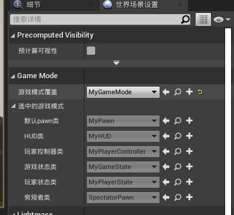


## 创建GameMode

右键空白处，点击“新建C++类”

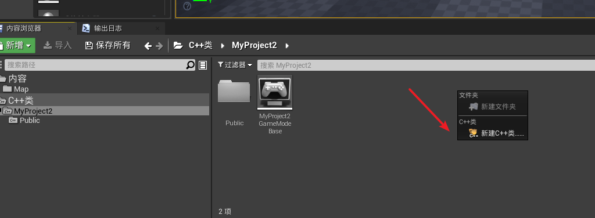

勾选“显示所有类”，选择GameMode

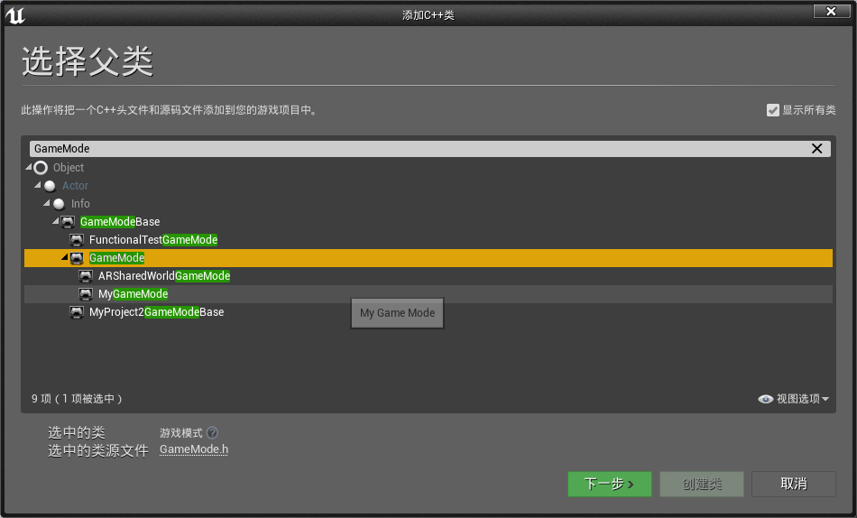

输入命名

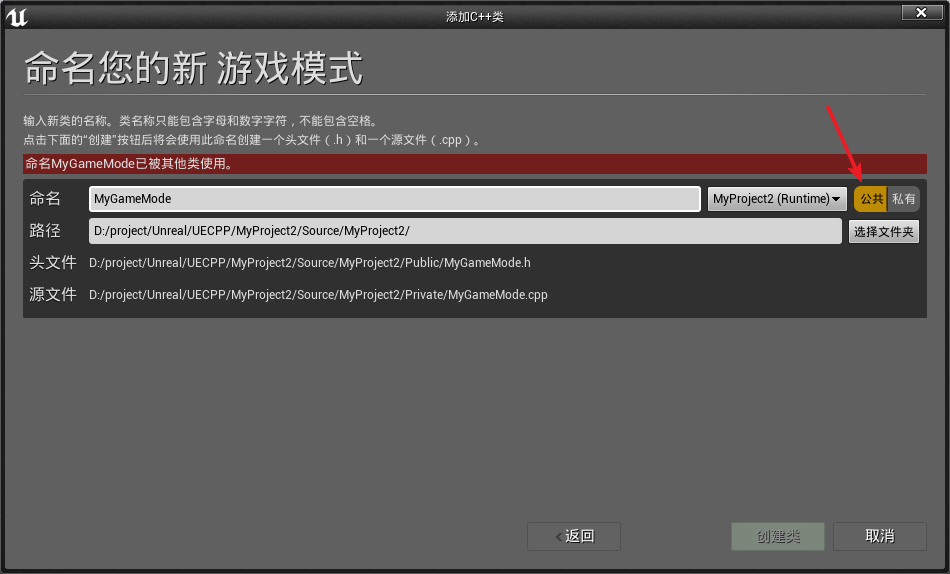


## 创建Pawn

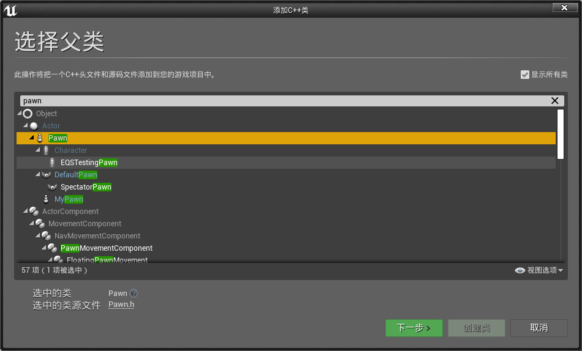


## 创建HUD

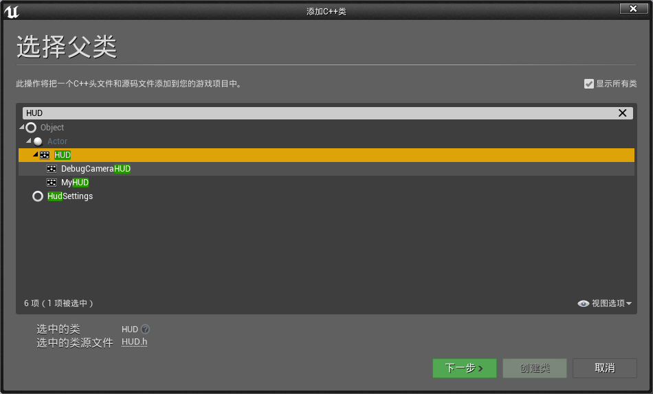


## 创建PlayController

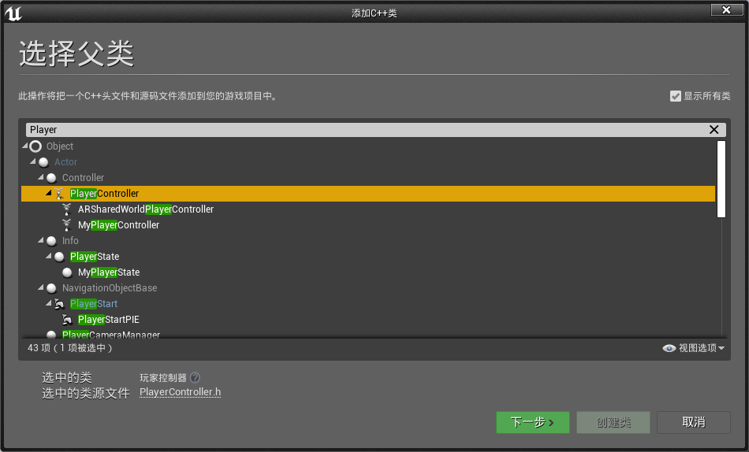


## 创建GameState

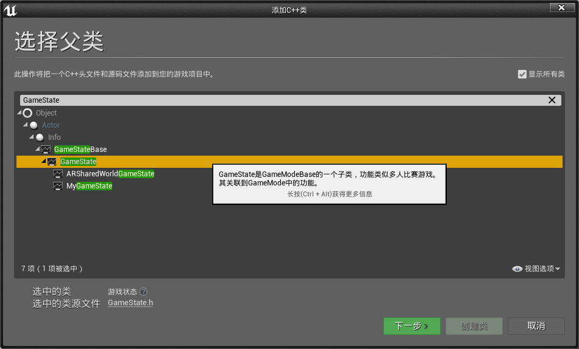

## 创建PlayerState

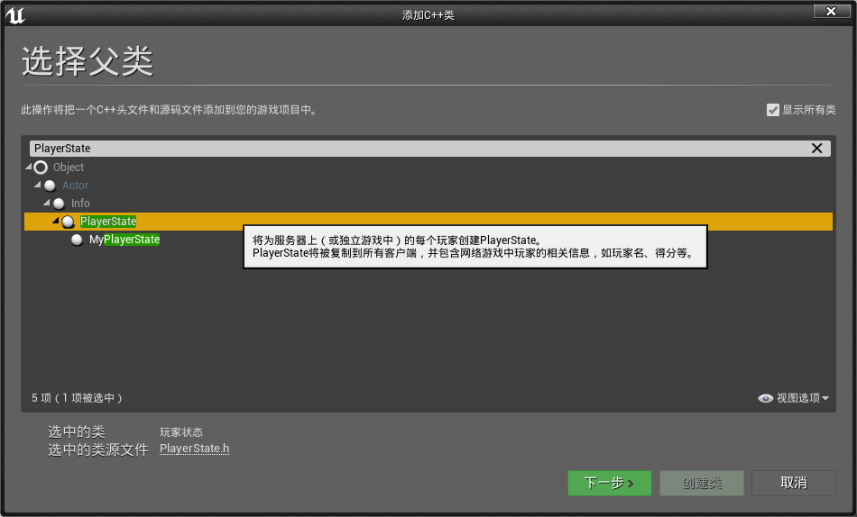


## 创建SpectatorPawn

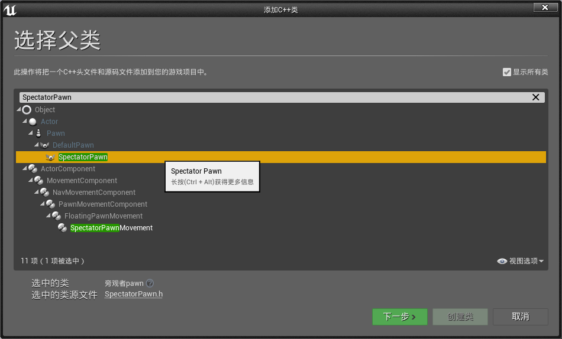


## 设置默认游戏模式

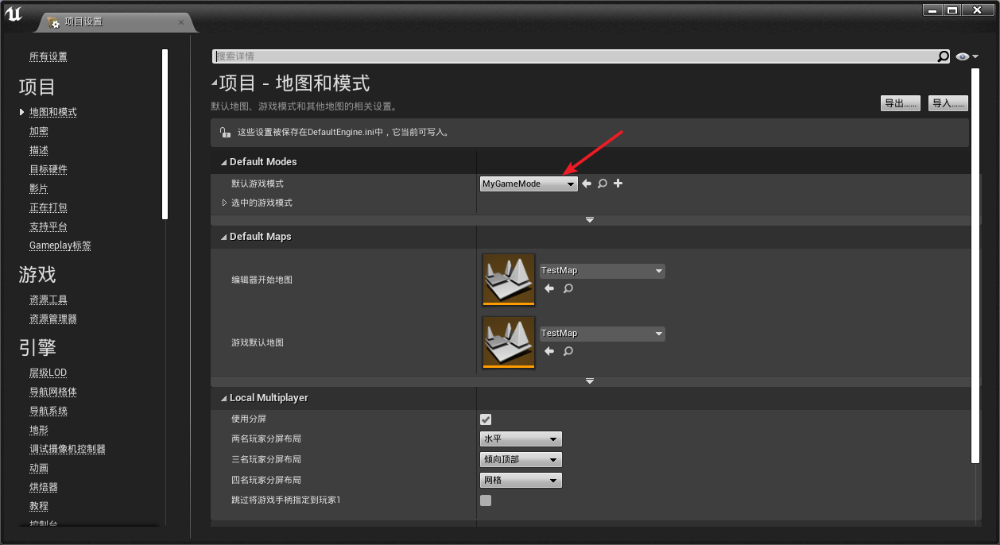


# 添加Pawn到场景中

## 创建基于MyPawn的蓝图类

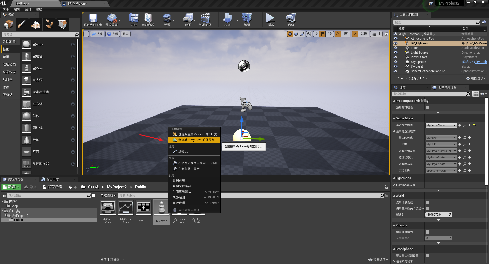

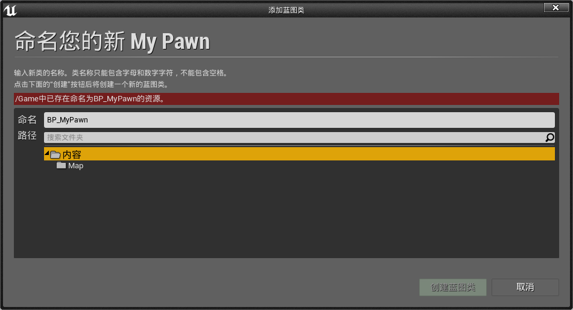


## 添加BP_MyPawn到场景中

将创建的BP_MyPawn拖到创建中，点击右侧的“编辑BP_MyPawn”可以进行蓝图编辑

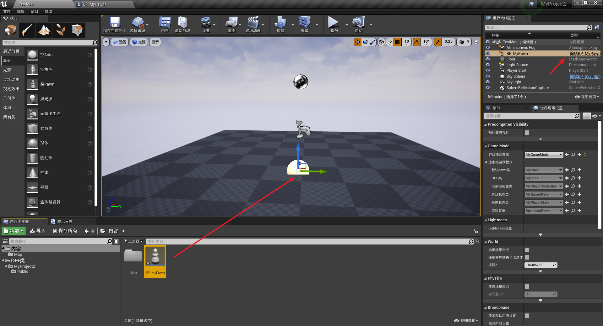


# 蓝图中的函数

```cpp
UCLASS()
class MYPROJECT2_API AMyGameMode : public AGameMode
{
	GENERATED_BODY()

	AMyGameMode();

public:
	//在游戏运行的一开始执行这个Beginplay()函数
	virtual void BeginPlay() override;
	//游戏运行的时候每一帧都在执行这个函数
	virtual void Tick(float DeltaTime) override;
	//这个是当我们游戏退出或者切换关卡的时候关卡卸载也会执行这个Endplay函数
	virtual void EndPlay(const EEndPlayReason::Type EndPlayReason) override;
}
```

在GameMode的构造函数中创建默认的类

```cpp
AMyGameMode::AMyGameMode() 
{
	DefaultPawnClass = AMyPawn::StaticClass();
	PlayerControllerClass = AMyPlayerController::StaticClass();
	GameStateClass = AMyGameState::StaticClass();
	PlayerStateClass = AMyPlayerState::StaticClass();
	HUDClass = AMyHUD::StaticClass();
}
```


## 打印日志

```cpp
void AMyGameMode::BeginPlay()
{
	Super::BeginPlay();

	//Logtemp临时日志记录类别名称，Warning日志记录级别，TEXT是打印的内容
	//日志记录级别常用的有三种,一种是Error、一种是Warning、一种Display,他们的级别是Error>warning>display
	//每一个颜色也是不一样的error是红色，Warning是黄色，Display是白色
	UE_LOG(LogTemp, Error, TEXT("My Name1 is ok"));
	UE_LOG(LogTemp, Warning, TEXT("My Name2 is ok"));
	UE_LOG(LogTemp, Display, TEXT("My Name3 is ok"));

	//打印到屏幕上
	//-1是默认值，5.0是打印显示的时间，FColor::Red显示的颜色，TEXT（打印的文本内容）
	GEngine->AddOnScreenDebugMessage(-1, 5.0f, FColor::Red, TEXT("My Name is ok in screen"));
}
```


# UE C++的变量

## 基础类型

```cpp
//布尔类型变量声明
bool varBool;
//整型32位的变量声明
int32 varInt32;
//整型64位的变量声明
int64 varInt64;
//字节类型的变量声明
BYTE varByte;
```

## 特殊类型

```cpp
//FString类型的变量声明字符串的类型
FString varString;
//FName名称类型的变量声明
FName varName;
//FText文本类型的变量声明
FText varText;
//FVector向量类型的变量声明
FVector varVector;//这个就是X轴，Y轴，Z轴的坐标
//FRotator旋转类型的变量声明
FRotator varRotator;//这个就是X轴的旋转Roll,Y轴的旋转Pitch,Z轴的旋转Yaw
//FTransform类型的变量声明
FTransform varTransform;//这个就是既有FVector也有FRotator,还有缩放Scale三者的集合类型int
```

### 字符串转换

```cpp
//创建一个Fstring
FString MyString = TEXT("I am string");
//Fstring转化成FName
FName MyName = FName(*MyString);
//Fstring转化成FText
FText MyText = FText::FromString(MyString);

//FName转化成FString
MyString = MyName.ToString();
//Fname转化成FText
FText text1 = FText::FromName(MyName);
//Ftext转化成FString
FString strFromText = text1.ToString();
//注意这里FTEXT不能直接转化成FName需要转化成FString，然后在转化成FName}
```

## 复合数据类型

```cpp
//TArrayTArray 是虚幻C++中的动态数组TArray 特点 : 速度快，内存消耗小，安全性高。并且TArray 所有元素均完全为相同类型，不能进行不同元素类型的混合
TArray<int32>MyArray;
void PrintF();

//TMap-是一种键值对容器，里面的数据都是成对出现的（Key，Value），Value通过Key值来获取，且Key值不能重复，key值唯一。
TMap<int32, int32>MyMap;
void PrintMap();

//TSet- TSet是一种快速容器类，（通常）用于在排序不重要的情况下存储唯一元素。
//TSet 类似于 TMap 和 TMultiMap，但有一个重要区别：TSet 是通过对元素求值的可覆盖函数，使用数据值本身作为键，而不是将数据值与独立的键相关联。
//TSet 可以非常快速地添加、查找和删除元素（恒定时间）,-TSet 也是值类型，支持常规复制、赋值和析构函数操作，以及其元素较强的所有权。

TSet<FString>MySet;
void PrintSet();
```

### 添加数据、获取数据

```cpp
void AMyGameMode::BeginPlay()
{
	Super::BeginPlay();
    ......
	//// TArray
	//增
	MyArray.Add(10);//将元素添加到我们的数组中
	MyArray.Add(20);
	MyArray.Add(30);
	MyArray.AddUnique(20);//数组中不存在的元素才会添加到我们的数组中所有20就不会添加到数组中
	MyArray.AddUnique(40);//40数组中没有就可以添加到数组中
	PrintF();
	//删
	MyArray.Remove(20);//移除数组中所有的等值元素
	MyArray.RemoveAt(0);//移除数组中索引值为0的元素
	MyArray.RemoveSingle(10);//移除首个匹配的元素
	MyArray.Empty();//清空我们的元素
	MyArray.Reset();//重置我们的元素所有变为0
	
	//改
	MyArray.Insert(60,0);//这个是在我们的0号位置插入一个元素60
	int32& temp = MyArray[0];
	temp = 50;//这样就修改了我们的数组元素
	//查
	MyArray.Contains(10);//查找我们数组是否包含了某个元素
	MyArray.Find(10);//正向查找我们的第一个匹配的元素如果找到的话返回真否则为假
	MyArray.FindLast(10);//反向的查找我们的第一个匹配的元素找到为真否则为假


	//// TMap
	//增
	MyMap.Emplace(0,1);//用法和Add一样，都是往容器中添加元素
	MyMap.Emplace(1,2);
	MyMap.Emplace(2,3);
	PrintMap();

	//删
	MyMap.Remove(0);//移除key值为0的元素
	MyMap.Empty();//清空我们的数据

	//查找
	MyMap.Contains(1);//查找匹配的Key值是否存在找到返回真，否则为假，进行两次查找
	int32* isFind = MyMap.Find(6);//也是查找匹配的Key值是否存在找到为真否则为假，只进行一次查找返回的是指针
	const int32* isFind2 = MyMap.FindKey(2);//反向查找，通过查找Value的值查找Key返回的也是指针
	//分别获取Keys和Values
	TArray<int32> TestKeys;
	TArray<int32> TestValues;
	MyMap.GenerateKeyArray(TestKeys);
	MyMap.GenerateValueArray(TestValues);


	//// TSet
	//添加元素
	MySet.Add(TEXT("Banana"));
	MySet.Add(TEXT("Grapefruit"));
	MySet.Add(TEXT("Pineapple"));
	MySet.Emplace(TEXT("Orange"));//add和Emplace都是添加元素到容器中，但是Emplace可以避免在插入集合时创建的临时文件
	PrintSet();

	//合并元素
	TSet<FString>MySet2;
	MySet2.Add(TEXT("zhangsan"));
	MySet2.Add(TEXT("lisi"));
	MySet2.Add(TEXT("wangwu"));
	MySet.Append(MySet2);//Append将Myset2合并到Myset中
	PrintSet();

	//移除元素
	MySet.Remove(TEXT("Banana"));//remove函数会返回已删除元素的数量，如果给定的键未包含在集合中，则返回0
	MySet.Reset();//清空集合元素但是会保留内存
	MySet.Empty();//清空容器释放内存

	//查找元素
	int32 Count = MySet.Num();//num函数是查询集合中保存的元素数量
	bool isFind1 = MySet.Contains(TEXT("Banana"));//Contains函数是查询是否包含特定的元素，找到为真否则为假
	
	FString* isFind211 = MySet.Find(TEXT("Banan"));//Find返回指向元素数值的指针，如果映射不包含该键，则返回Null

	//Array函数
	TArray<FString> FruitArray = MySet.Array();//函数会返回一个Tarray,其中填充了TSet中每一个元素的副本

	//排序
	TSet<FString>TestSet = {TEXT("a"),TEXT("aa") ,TEXT("aaa"),TEXT("aaaa") };
	TestSet.Sort([](FString A, FString B) {return A.Len() > B.Len(); });

	//运算符 =
	TSet<FString>NewSet;
	NewSet = MySet;//讲MySet的里面的值赋给NewSet
	NewSet.Add("TEXT(OneOne)");

	//[]
	FSetElementId Index = NewSet.Add(TEXT("Twotwo"));//根据FSetElementID访问集合对应元素的引用
	TestSet[Index] = TEXT("One");

	//ReServe
	TSet<FString>NewSet1;
	NewSet1.Reserve(10);//预先分配内存，若输入的Number大于元素的个数，则会产生闲置内存（Slack）
	//Shrink
	for (int32 i = 0; i < 10; i++)
	{
		NewSet1.Add(FString::Printf(TEXT("NewSet%d"),i));//添加元素
	}
	for (int32  i = 0; i < 10; i+=2)
	{
		NewSet1.Remove(FSetElementId::FromInteger(i));//删除元素产生闲置内存
	}
	NewSet1.Shrink();//删除末端的空元素

	//Compact将容器中的所有空白的元素集合到一起放到末尾一起删除
	NewSet1.Compact();//注意Compact可能会改变元素之间的顺序，如果不想改变顺序，可以使用CompactStable
	NewSet1.Shrink();


	//基础数据类型的输出打印
	int32 MyInt = 10;
	float MyFloat = 5.0f;
	bool MyBool = true;
	char MyChar = 'A';
	FString MyString1 = TEXT("MyString1");
	FVector MyVector = FVector(0, 0, 0);
	UE_LOG(LogTemp, Warning, TEXT("%d"), MyInt);
	UE_LOG(LogTemp, Warning, TEXT("%f"), MyFloat);
	UE_LOG(LogTemp, Warning, TEXT("%d"), MyBool);
	UE_LOG(LogTemp, Warning, TEXT("%c"), MyChar);
	UE_LOG(LogTemp, Warning, TEXT("%s"), *MyString1);
	UE_LOG(LogTemp, Warning, TEXT("%s"), *MyVector.ToString());
}


void AMyGameMode::PrintF()
{	
	//我们用迭代器遍历一下数组打印出来
	/*for (auto It = MyArray.CreateConstIterator(); It; It++)
	{
		UE_LOG(LogTemp, Warning, TEXT("%d"), *It);
		GEngine->AddOnScreenDebugMessage(-1, 5.0f, FColor::Blue, FString::Printf(TEXT("%d"), *It));
	}*/

	for (auto it : MyArray) {
		UE_LOG(LogTemp, Warning, TEXT("%d"), it);
		GEngine->AddOnScreenDebugMessage(-1, 5.0f, FColor::Blue, FString::Printf(TEXT("%d"), it));
	}
}


void AMyGameMode::PrintMap()
{
	for (auto& TestMap : MyMap)
	{
		GEngine->AddOnScreenDebugMessage(-1, 5.0f, FColor::Blue, FString::Printf(TEXT("Key: %d" "Value: %d"), TestMap.Key, TestMap.Value));
		UE_LOG(LogTemp, Warning, TEXT("Key: %d Value: %d"), TestMap.Key, TestMap.Value);
	}
}


void AMyGameMode::PrintSet()
{
	for (auto& TestSet : MySet)
	{
		GEngine->AddOnScreenDebugMessage(-1, 5.0f, FColor::Blue, FString::Printf(TEXT("%s"), *TestSet));
		UE_LOG(LogTemp, Warning, TEXT("%s"), *TestSet);
	}
}
```


# C++与蓝图的交互

## VisibleDefaultsOnly（仅在类默认设置可见）

```cpp
//仅在类默认设置可见
UPROPERTY(VisibleDefaultsOnly)
int32 VisibleDefaultsOnlyint;
```

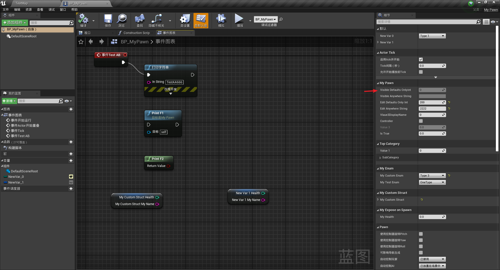

## VisibleInstanceOnly（仅在实例化细节面板可见）

```cpp
//仅在实例化细节面板可见
UPROPERTY(VisibleInstanceOnly)
FVector VisibleInstanceOnlyVector;
```

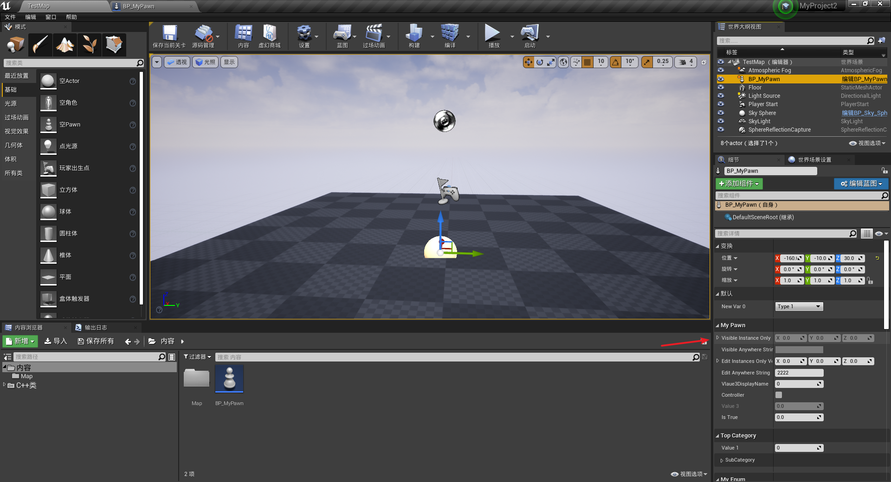

## VisibleAnywhere（类默认设置和实例化细节面板都可见）

```cpp
//类默认设置和实例化细节面板都可见
UPROPERTY(VisibleAnywhere)
FString VisibleAnywhereString;
```

## EditDefaultsOnly（仅在类默认设置里可编辑）

```cpp
//仅在类默认设置里可编辑
UPROPERTY(EditDefaultsOnly)
int32 EditDefaultsOnlyInt;
```

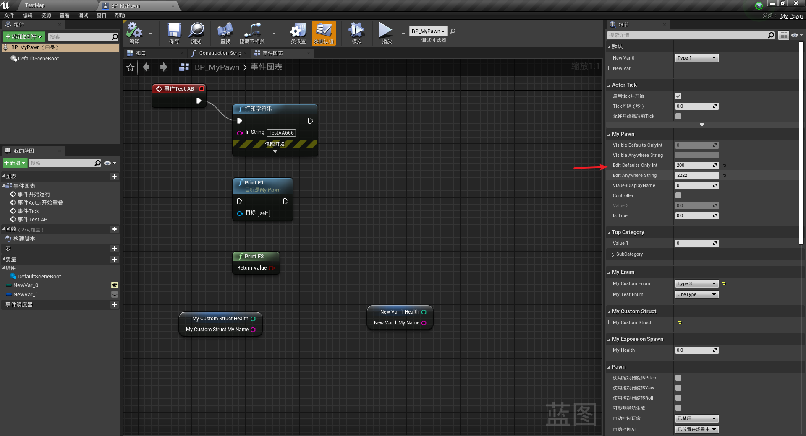

## EditInstanceOnly（仅在实例化细节面板可编辑）

```cpp
//仅在实例化细节面板可编辑
UPROPERTY(EditInstanceOnly)
FVector EditInstancesOnlyVector;
```

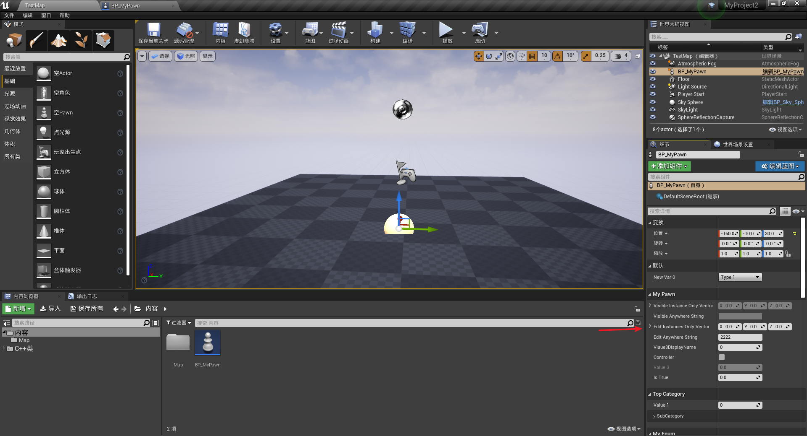

## EditAnywhere（在类默认设置和实例化细节面板都可以编辑）

```cpp
//在类默认设置和实例化细节面板都可以编辑
UPROPERTY(EditAnywhere)
FString EditAnywhereString;
```


## BlueprintReadOnly（仅仅蓝图可读）

```cpp
//仅仅蓝图可读
UPROPERTY(BlueprintReadOnly)
int32 BlueprintReadOnlyInt;
```

## BlueprintReadWrite（蓝图可读可写）

```cpp
//蓝图可读可写
UPROPERTY(BlueprintReadWrite)
int32 BlueprintReadWriteint;
```

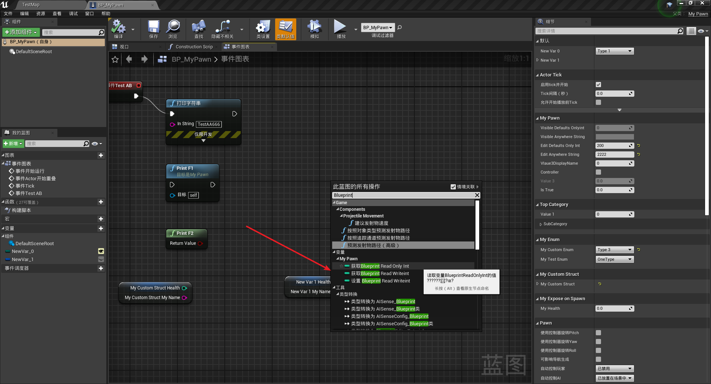


## Category（目录）

给变量分组使用的

```cpp
//Category目录
//第一层目录
UPROPERTY(EditAnywhere, BlueprintReadWrite, Category = "TopCategory")
int32 value1;

//第二层目录
UPROPERTY(EditAnywhere, BlueprintReadWrite, Category = "TopCategory|SubCategory")
int32 value2;
```


## DisplayName（别名）

```cpp
//别名
UPROPERTY(EditAnywhere, BlueprintReadWrite, meta = (DisplayName = "Vlaue3DisplayName"))
int32 Myvalue3;
```

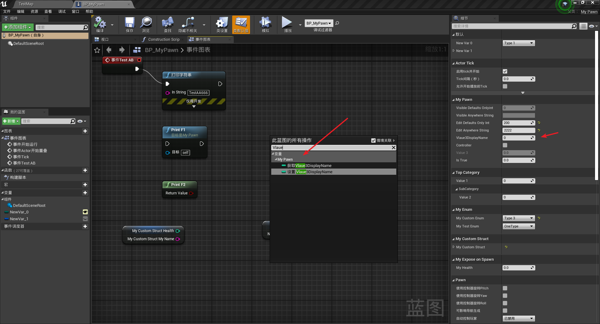


## EditCondition（条件控制编辑）

```cpp
//EditCondition条件控制编辑
UPROPERTY(EditAnywhere, BlueprintReadWrite, meta = (DisplayName = "Controller"))
bool isController;
UPROPERTY(EditAnywhere, BlueprintReadWrite, meta = (EditCondition = "isController"))
float value3;
```

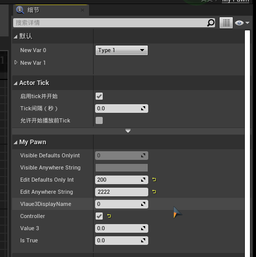


## ToolTip（解释变量说明）

```cpp
//解释变量说明
UPROPERTY(EditAnywhere, BlueprintReadWrite, meta = (ToolTip = "isControllerTrue"))
float isTrue;
```

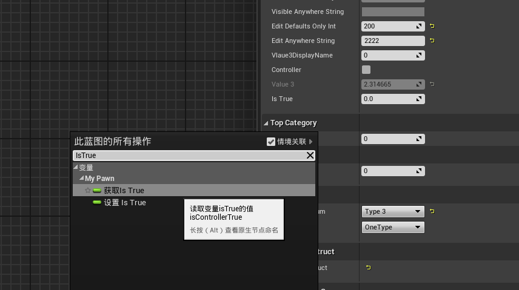


## BlueprintCallable（暴露我们的函数在蓝图中调用）

```cpp
//暴露我们的函数在蓝图中调用
UFUNCTION(BlueprintCallable, Category = "MyFunction")
void PrintF1();


void AMyPawn::PrintF1()
{
}
```

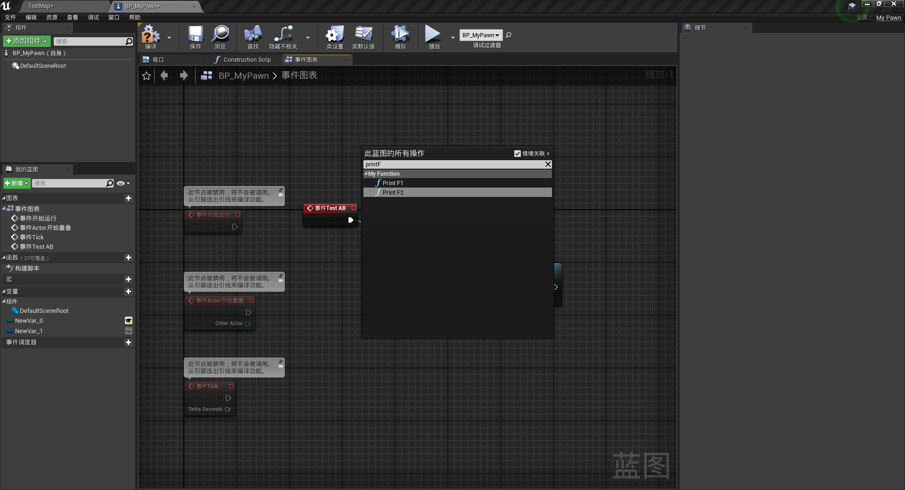


## BlueprintPure（纯虚函数的定义）

```cpp
//纯虚函数的定义BlueprintPure
UFUNCTION(BlueprintCallable, BlueprintPure, Category = "MyFunction")
bool PrintF2();

bool AMyPawn::PrintF2()
{
	return true;
}
```


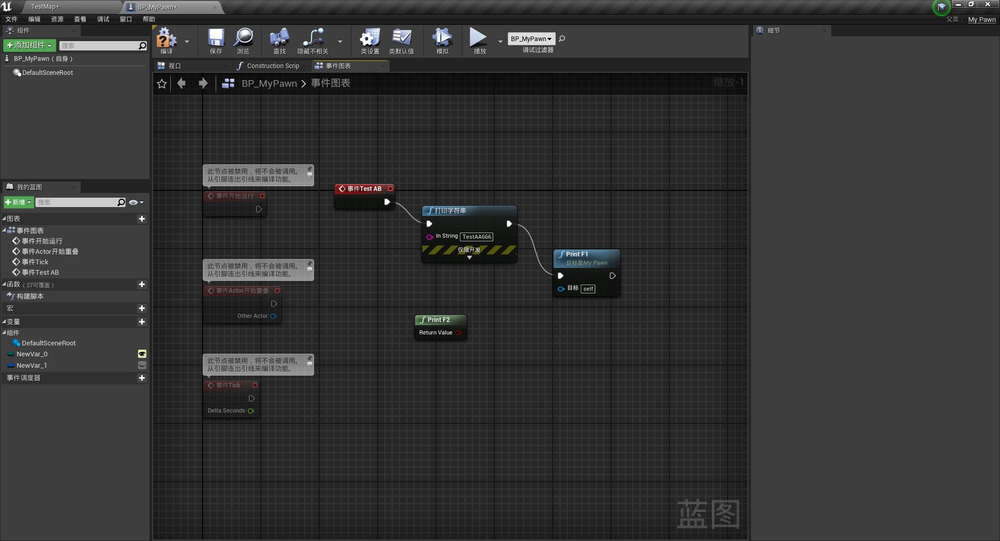


## BlueprintImplementableEvent（C++中声明，不能定义，蓝图中重载）

`BlueprintImplementableEvent`在C++中声明，不能定义，蓝图可重载，没返回值的是事件，有返回值的是函数

```cpp
//BlueprintImplementableEvent在C++中声明，不能定义，蓝图可重载，没返回值的是事件，有返回值的是函数
UFUNCTION(BlueprintImplementableEvent)
void Test1();
UFUNCTION(BlueprintImplementableEvent)
int Test2();
UFUNCTION(BlueprintImplementableEvent)
void Test11(const FString& str);
UFUNCTION(BlueprintImplementableEvent)
int Test22(const FString& str);
```


Test1没有返回值，是一个事件

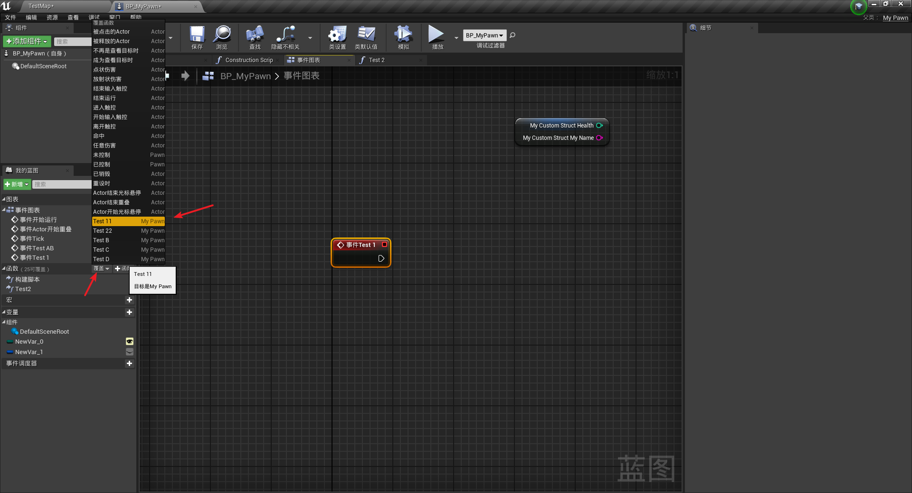


Test2有返回值，是一个函数


Test11有参数，但是没有返回值，也是一个事件

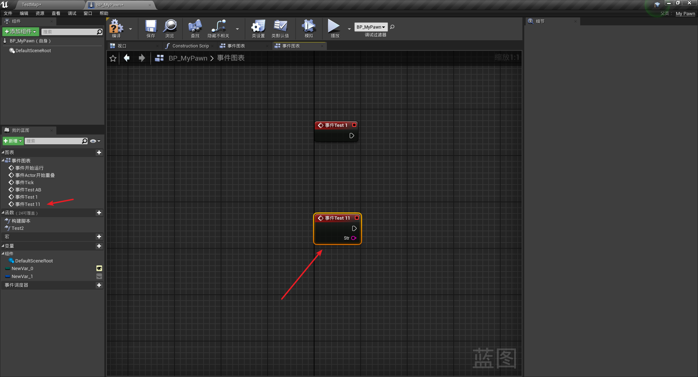


Test22有参数，也有返回值，是一个函数

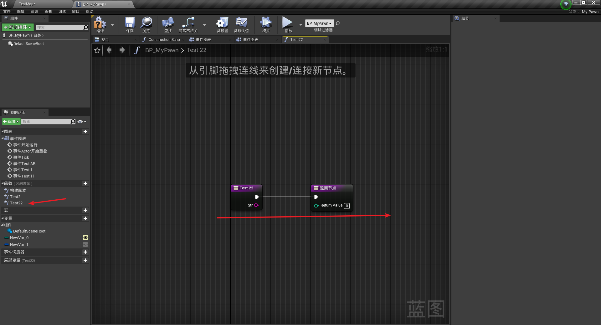


## BlueprintNativeEvent（在C++中声明和实现，蓝图可重载或者不重载）

`BlueprintNativeEvent`在C++中声明和实现，蓝图可重载或者不重载。C++中实现的方法需要增加"_Implementation",如：TestA需要变成TestA_Implementation，蓝图中实现了方法后，会先调用蓝图中连接的节点（重载），然后再执行实现的TestAA_Implementation方法

```cpp
UFUNCTION(BlueprintNativeEvent)
void TestAB();
UFUNCTION(BlueprintNativeEvent)
int TestB();
UFUNCTION(BlueprintNativeEvent)
void TestC(const FString& str);
UFUNCTION(BlueprintNativeEvent)
int TestD(const FString& str);


// Called when the game starts or when spawned
void AMyPawn::BeginPlay()
{
	Super::BeginPlay();
	
	//调用事件函数，启动后先调用TestAA事件，调用蓝图中连接的节点，然后再执行实现的TestAA_Implementation方法
	TestAB();
}
void AMyPawn::TestAB_Implementation()
{
	GEngine->AddOnScreenDebugMessage(-1, 5.0f, FColor::Red, TEXT("TestAA"));
}

int AMyPawn::TestB_Implementation()
{
	return 0;
}

void AMyPawn::TestC_Implementation(const FString& str)
{
}

int AMyPawn::TestD_Implementation(const FString& str)
{
	return 0;
}
```

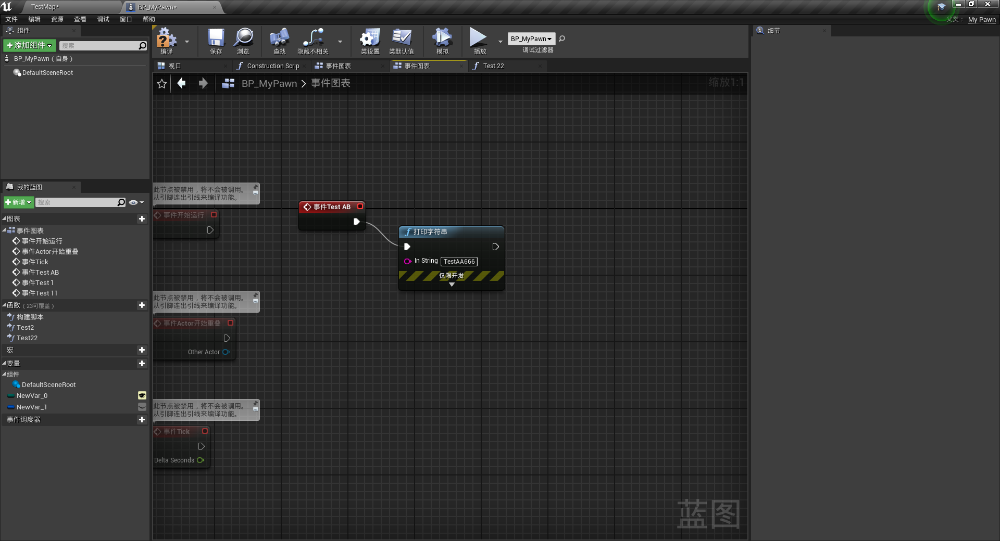


先打印`TestAA666`，说明先执行了蓝图中的方法，再打印了`TestAA`，说明执行了`TestAB_Implementation`方法

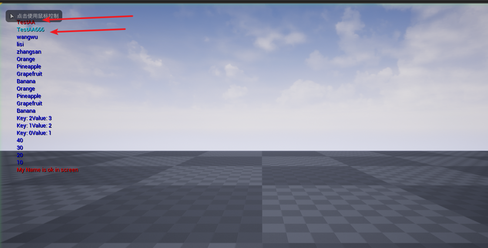


## DisplayName（别名）

```cpp
UFUNCTION(BlueprintCallable, Category = "MyFunction", meta = (DisplayName = "MyPrinttest"))
void PrintTest();
```

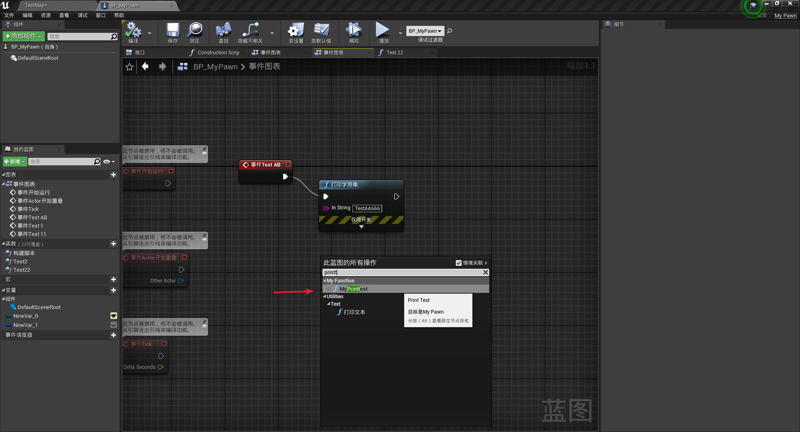

## 定义枚举

```cpp
UENUM(BlueprintType)
namespace MyEnumType22
{
	enum MyCustomEnum
	{
		Type1,
		Type2,
		Type3,
	};
}

UCLASS()
class MYPROJECT2_API AMyPawn : public APawn
{
 	......
    //定义枚举
    UPROPERTY(EditAnywhere, BlueprintReadWrite, Category = "MyEnum")
    TEnumAsByte<MyEnumType22::MyCustomEnum> MyCustomEnum;
 	......   
}
```

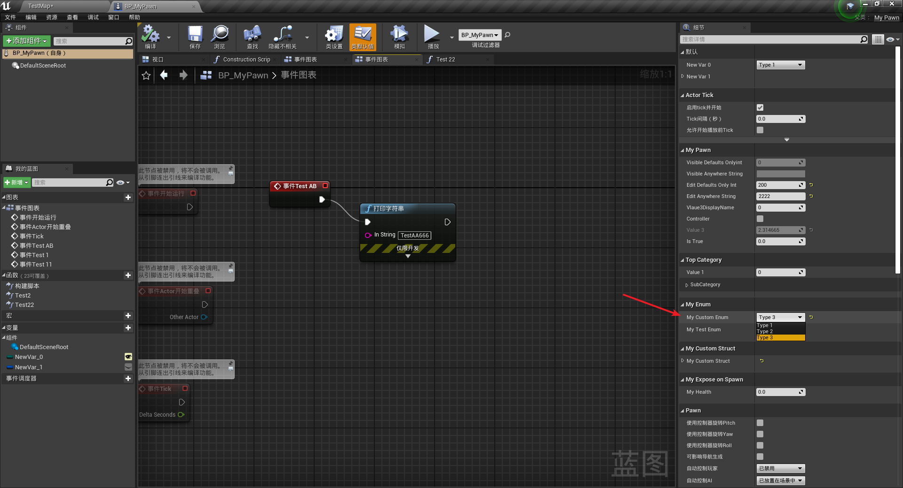

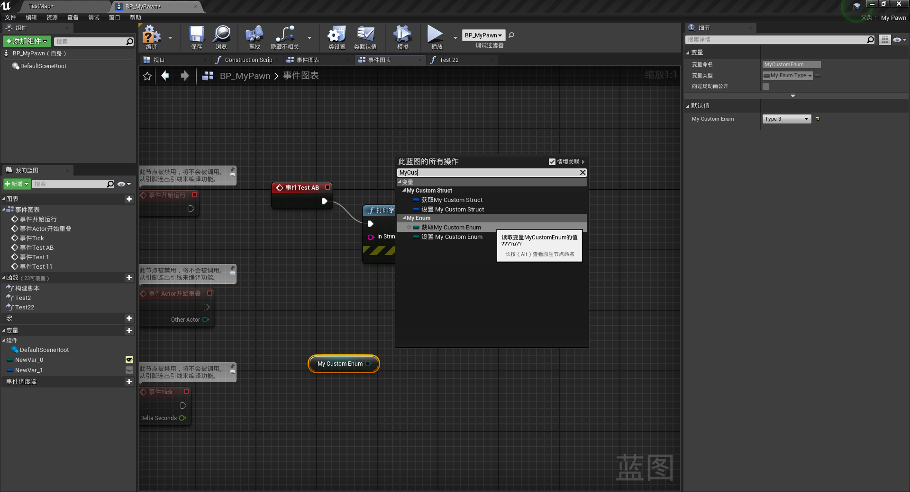

下拉框选择的枚举类型使用的是命名空间定义的`MyEnumType22`

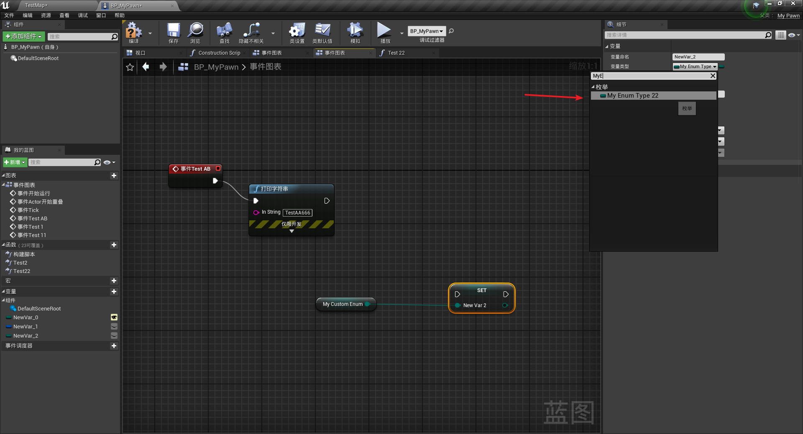

## 另一种枚举声明方式

```cpp
UENUM(BlueprintType)
enum class EMyTestEnum : uint8
{
	OneType UMETA(DisplayName = "OneType"),
	TwoeType UMETA(DisplayName = "TwoeType"),
	ThreeType UMETA(DisplayName = "ThreeType")
};


UCLASS()
class MYPROJECT2_API AMyPawn : public APawn
{
	GENERATED_BODY()
	......
    //另一种枚举声明方式
	UPROPERTY(EditAnywhere, BlueprintReadWrite, Category = "MyEnum")
	EMyTestEnum MyTestEnum;
    ......
}
```

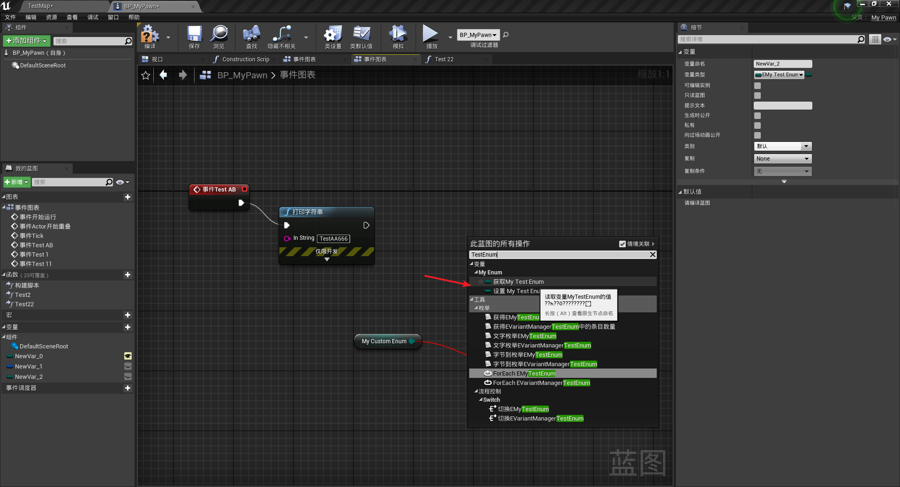

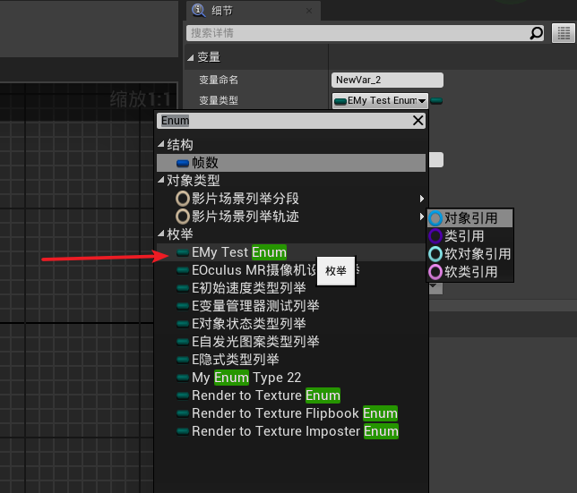


## 定义结构体

```cpp
USTRUCT(BlueprintType)
struct FMyTestStruct
{
	GENERATED_USTRUCT_BODY()

	UPROPERTY(EditAnywhere, BlueprintReadWrite, Category = "MyTestStruct")
	int32 Health;

	UPROPERTY(EditAnywhere, BlueprintReadWrite, Category = "MyTestStruct2")
	FString MyName;

};

UCLASS()
class MYPROJECT2_API AMyPawn : public APawn
{
	GENERATED_BODY()
    ......
 	//定义结构体
	UPROPERTY(EditAnywhere, BlueprintReadWrite, Category = "MyCustomStruct")
	FMyTestStruct myCustomStruct;       
    ......
}
```

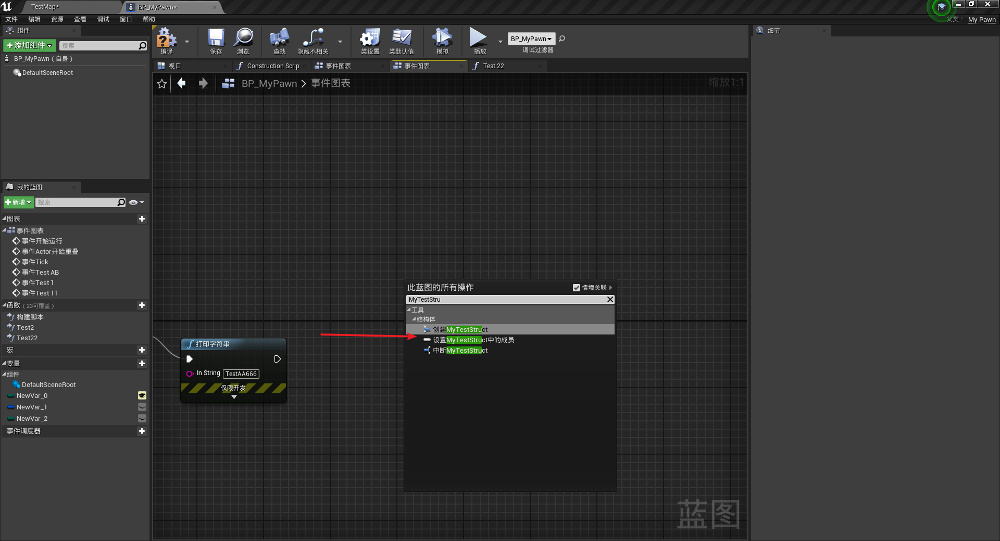

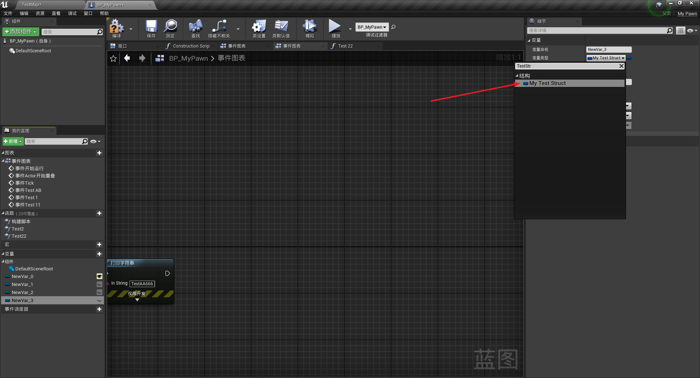


## ExposeOnSpawn（生成时公开）

```cpp
UPROPERTY(EditAnywhere, BlueprintReadWrite, Category = "MyExposeOnSpawn", meta = (ExposeOnSpawn = "ExposeOnSpawnValue"))
float MyHealth;
```

打开关卡蓝图

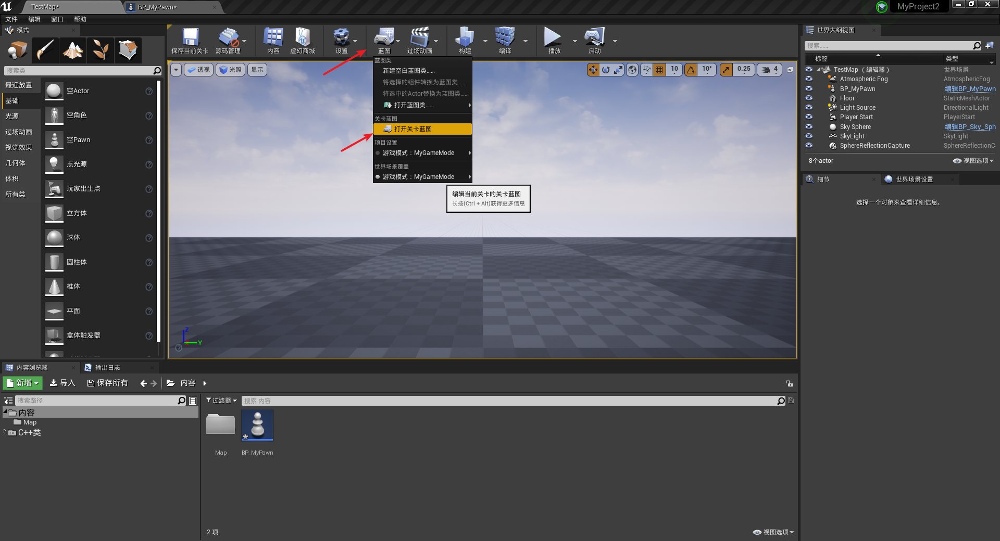


右键蓝图空白处，输入`actor from class`，选择`BP_MyPawn`，可以看到MyHealth变量在创建时公开了，可以设置

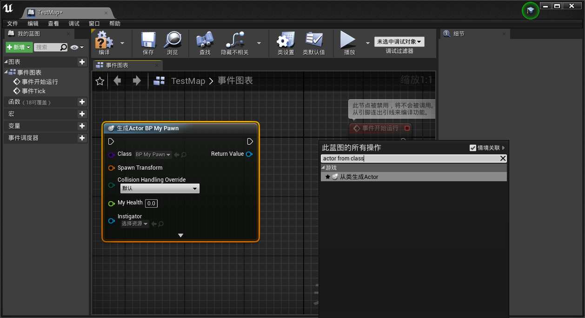


等同于在蓝图中设置变量`生成时公开`

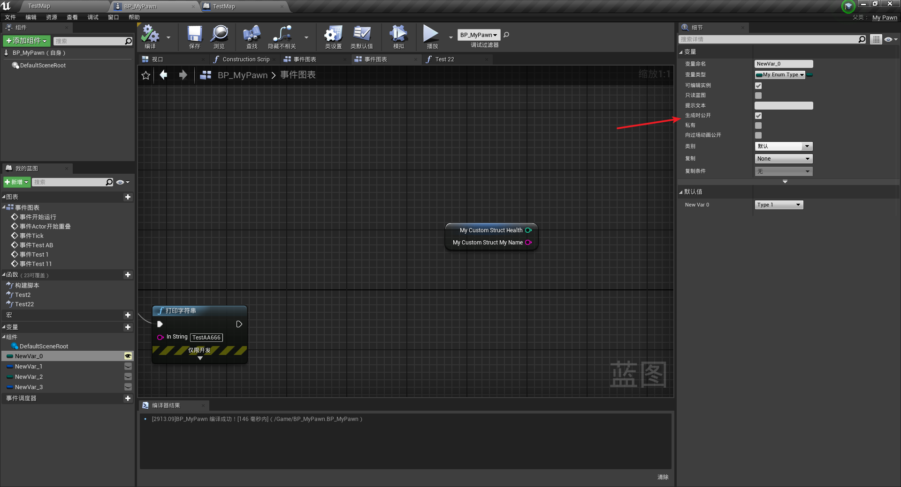


## 结构体创建数据表格

### 创建Object

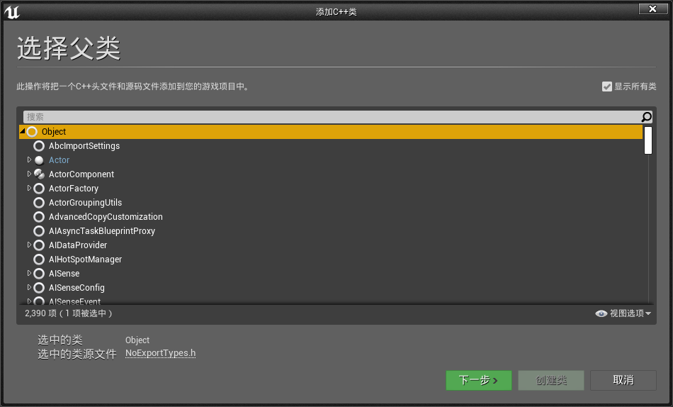

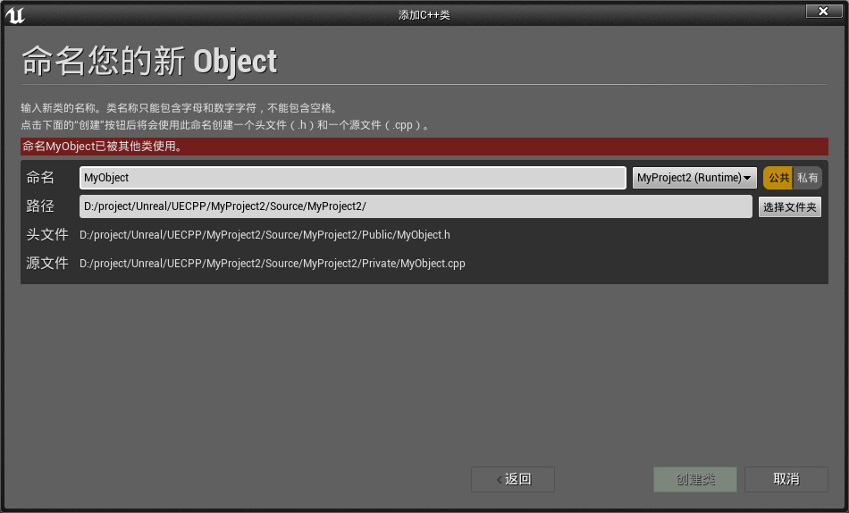


### 定义结构体

引入头文件

```cpp
#include <Engine/Classes/Engine/DataTable.h>
```


```cpp
// Fill out your copyright notice in the Description page of Project Settings.

#pragma once

#include "CoreMinimal.h"
#include "UObject/NoExportTypes.h"
#include <Engine/Classes/Engine/DataTable.h>
#include "MyObject.generated.h"

USTRUCT(BlueprintType)
struct FMyDataTableStruct : public FTableRowBase
{
	GENERATED_USTRUCT_BODY()
	UPROPERTY(EditAnywhere, BlueprintReadWrite, Category = "MyTestDataTableStruct")
		float Health;
	UPROPERTY(EditAnywhere, BlueprintReadWrite, Category = "MyTestDataTableStruct")
		FString Name;
	UPROPERTY(EditAnywhere, BlueprintReadWrite, Category = "MyTestDataTableStruct")
		int32 level;

};
/**
 * 
 */
UCLASS()
class MYPROJECT2_API UMyObject : public UObject
{
	GENERATED_BODY()
	
};

```

### 创建Excel

|      | Health | Name     | level |
| ---- | ------ | -------- | ----- |
| 0    | 10     | zhangsan | 1     |
| 1    | 20     | lisi     | 1     |
| 2    | 30     | wangwu   | 1     |

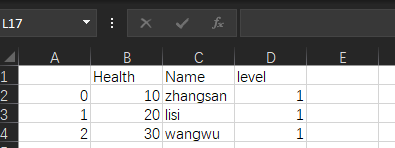

另存为csv

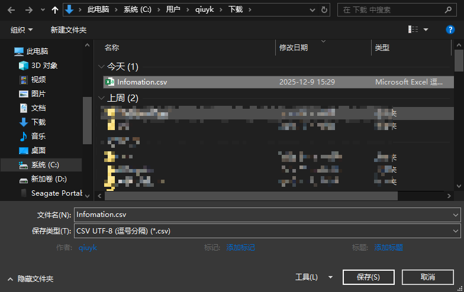


### 加载csv

将csv拖入到场景中，选择数据表的行类型为“FMyDataTableStruct”

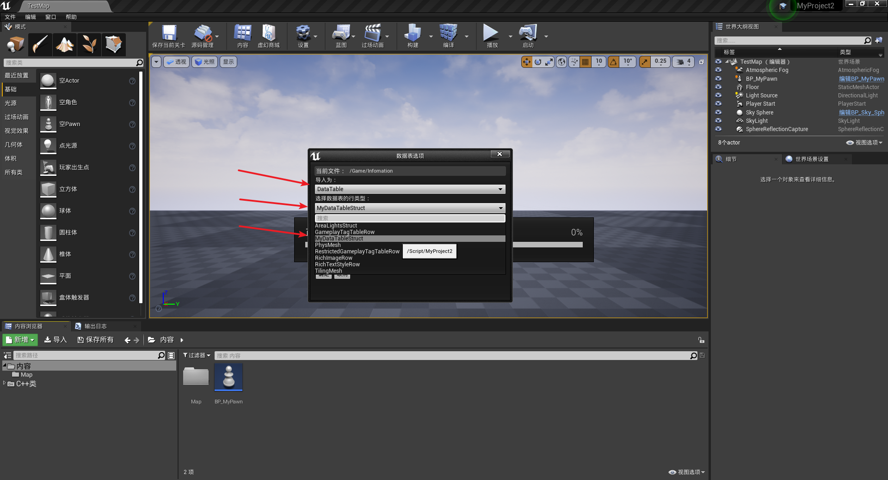


点击确定，就会生成一个数据表，双击就可以看到内容

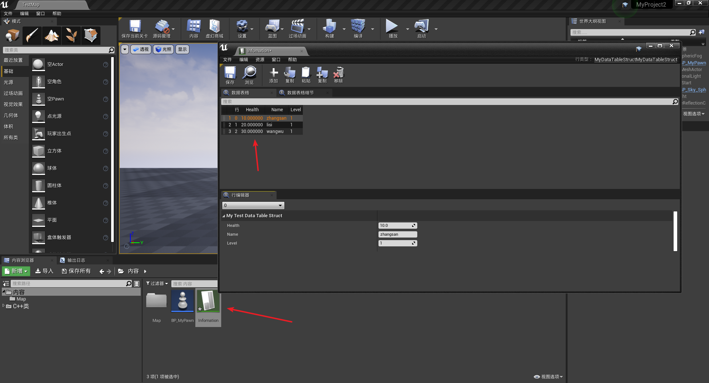