# UObject的实例化

## 创建UObject

### 引入头文件

```cpp
#include "MyObject.h"
```

### 声明成员变量

```cpp
UPROPERTY()
UMyObject* MyTestObject;
```

### 创建UObject

```cpp
// Called when the game starts or when spawned
void AMyPawn::BeginPlay()
{
	Super::BeginPlay();
	......
        
	TSubclassOf<UMyObject> MySubClassObject = UMyObject::StaticClass();
	MyTestObject = NewObject<UMyObject>(GetWorld(), MySubClassObject);
	if (MyTestObject)
	{
		UE_LOG(LogTemp, Warning, TEXT("MyTestObject is %s"), *MyTestObject->GetName());
	}
}
```

## 访问UObject的成员变量

### 增加结构体成员变量

```cpp
UCLASS()
class UECPPPROJECT_API UMyObject : public UObject
{
	GENERATED_BODY()
	
public:
	UPROPERTY()
	FMyDataTableStruct MyDataTableStruct;
};
```

### 结构体增加构造函数

在构造函数中给成员变量赋值

```cpp
USTRUCT(BlueprintType)
struct FMyDataTableStruct : public FTableRowBase
{
	GENERATED_USTRUCT_BODY()

	FMyDataTableStruct();

	UPROPERTY(EditAnywhere, BlueprintReadWrite, Category = "MyTestDataTableStruct")
		float Health;
	UPROPERTY(EditAnywhere, BlueprintReadWrite, Category = "MyTestDataTableStruct")
		FString Name;
	UPROPERTY(EditAnywhere, BlueprintReadWrite, Category = "MyTestDataTableStruct")
		int32 level;
};


FMyDataTableStruct::FMyDataTableStruct()
{
	//给成员变量赋值
	this->Health = 2.0f;
	this->Name = TEXT("张三");
	this->level = 2.f;
}
```

### 获取UObject的成员变量并打印

```cpp
void AMyPawn::BeginPlay()
{
	Super::BeginPlay();
	
	//调用事件函数，启动后先调用TestAA事件，调用蓝图中连接的节点，然后再执行实现的TestAA_Implementation方法
	TestAB();

	TSubclassOf<UMyObject> MySubClassObject = UMyObject::StaticClass();
	MyTestObject = NewObject<UMyObject>(GetWorld(), MySubClassObject);
	if (MyTestObject)
	{
		UE_LOG(LogTemp, Warning, TEXT("MyTestObject is %s"), *MyTestObject->GetName());
		UE_LOG(LogTemp, Warning, TEXT("MyTestObject Health is %f"), MyTestObject->MyDataTableStruct.Health);
		UE_LOG(LogTemp, Warning, TEXT("MyTestObject Name is %s"), *MyTestObject->MyDataTableStruct.Name);
		UE_LOG(LogTemp, Warning, TEXT("MyTestObject level is %f"), MyTestObject->MyDataTableStruct.level);
	}

}
```

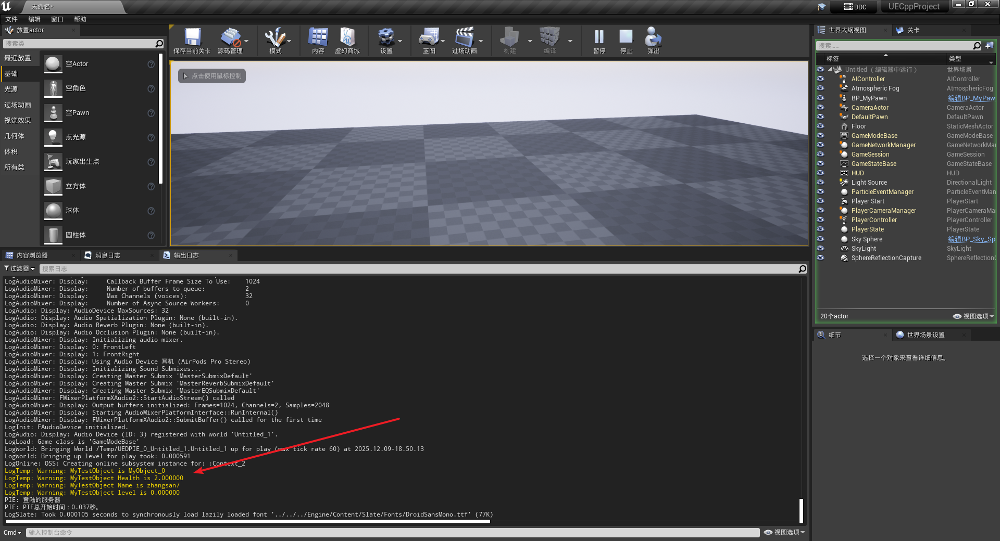

# UGameInstance的实例化

Gamelnstance 全局唯一单例，这个在引擎初始化的的时候就已经生成，一直存在到引擎关闭。

作用：

1. 引擎初始化与关闭时执行的逻辑
2. 为游戏保存全局数据：比如上一个关卡的信息需要在下一个关卡使用时我们用 GameInstanc保存数据但是只是临时数据，游戏结束则消失，如果想要本地持久保存数据需要用SaveGame


## 创建GameInstance


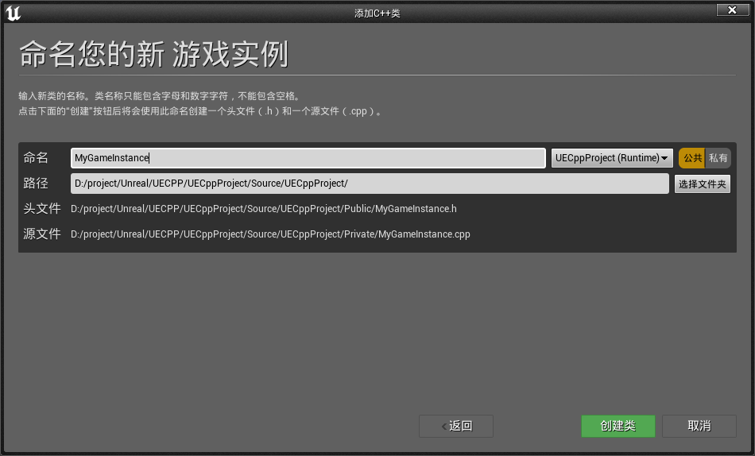

## 创建成员变量和构造函数

```cpp
UCLASS()
class UECPPPROJECT_API UMyGameInstance : public UGameInstance
{
	GENERATED_BODY()
	
public:
	UMyGameInstance();
	UPROPERTY(EditAnyWhere, BlueprintReadWrite, Category = "MyInstance")
		FString MyAppID;
	UPROPERTY(EditAnyWhere, BlueprintReadWrite, Category = "MyInstance")
		FString MyUserID;
	UPROPERTY(EditAnyWhere, BlueprintReadWrite, Category = "MyInstance")
		FString MyName;

};


UMyGameInstance::UMyGameInstance()
{
	MyAppID = TEXT("123");
	MyUserID = TEXT("456");
	MyName = TEXT("wangwu");
}
```

## 获取GameInstance中的值并打印

```cpp
void AMyPawn::BeginPlay()
{
	Super::BeginPlay();
	......
	MyInstance = Cast<UMyGameInstance>(GetWorld()->GetFirstPlayerController()->GetGameInstance());
	if (MyInstance) {
		UE_LOG(LogTemp, Warning, TEXT("MyInstance is %s"), *MyInstance->GetName());
		UE_LOG(LogTemp, Warning, TEXT("MyInstance MyAppID is %s"), *MyInstance->MyAppID);
		UE_LOG(LogTemp, Warning, TEXT("MyInstance MyUserID is %s"), *MyInstance->MyUserID);
		UE_LOG(LogTemp, Warning, TEXT("MyInstance MyName is %s"), *MyInstance->MyName);
	}
}
```

## 设置项目的GameInstance

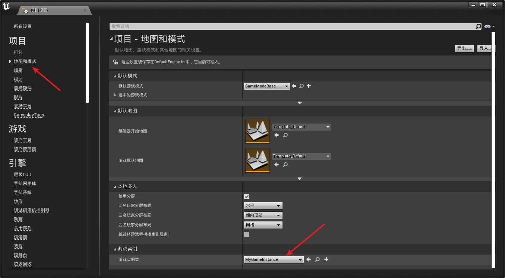

## 运行结果

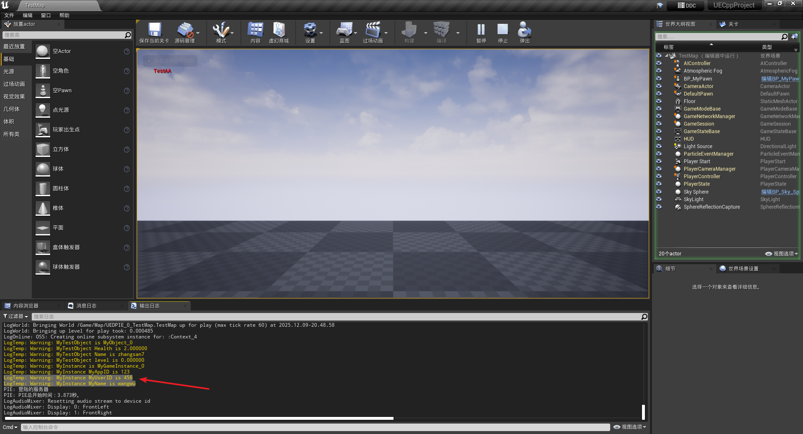


# 创建Actor并初始化组件

## 蓝图中创建Actor

创建蓝图类

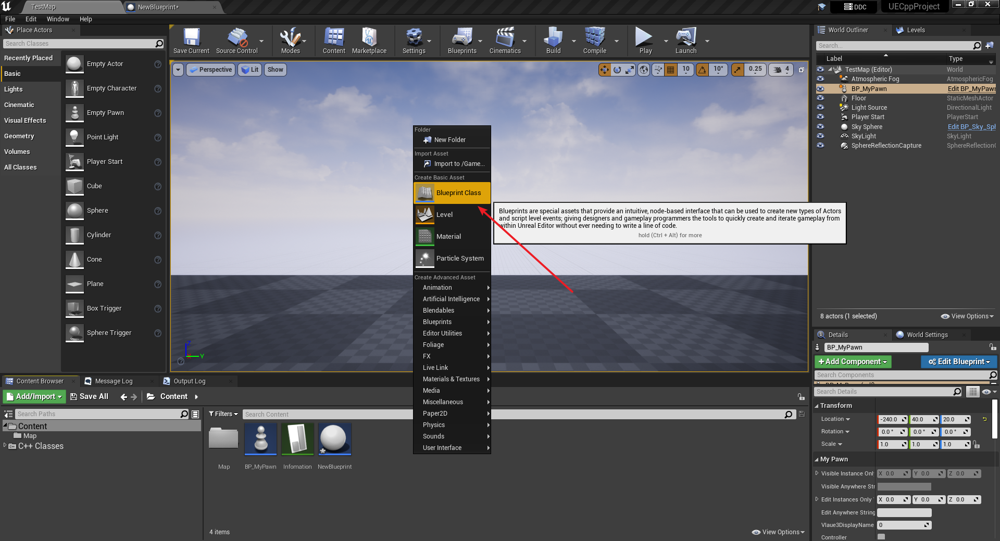

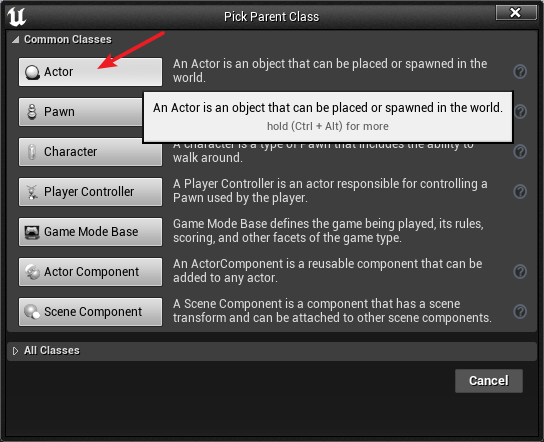


添加组件

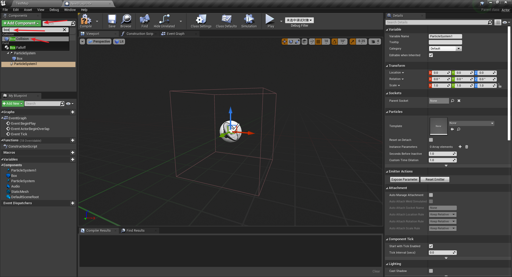


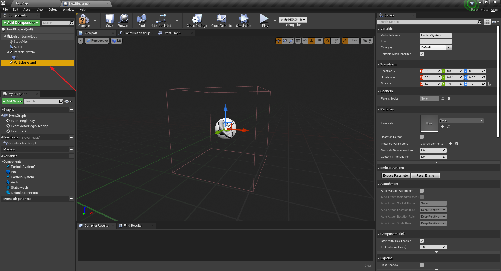


## C++中创建Actor

### 创建Actor类

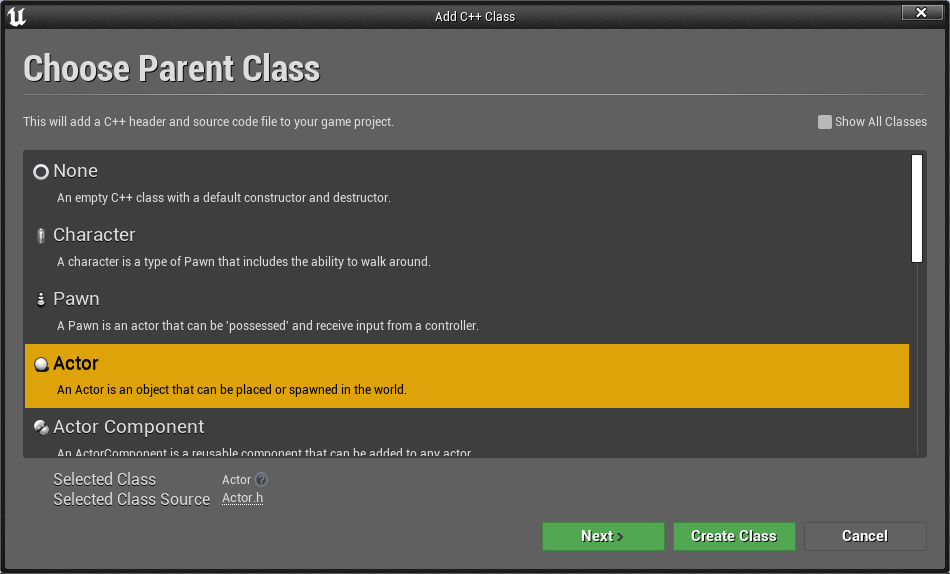

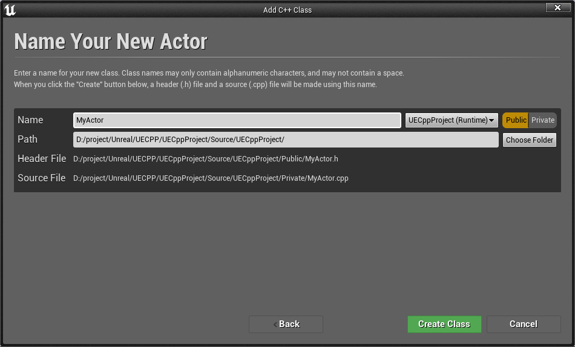

### 引入头文件，声明变量

```cpp
// Fill out your copyright notice in the Description page of Project Settings.

#pragma once

#include "CoreMinimal.h"
#include "GameFramework/Actor.h"
#include <Components/SceneComponent.h>
#include <Components/StaticMeshComponent.h>
#include <Components/BoxComponent.h>
#include <Components/AudioComponent.h>
#include <Particles/ParticleSystemComponent.h>

#include "MyActor.generated.h"

UCLASS()
class UECPPPROJECT_API AMyActor : public AActor
{
	GENERATED_BODY()
	
public:	
	// Sets default values for this actor's properties
	AMyActor();

protected:
	// Called when the game starts or when spawned
	virtual void BeginPlay() override;

public:	
	// Called every frame
	virtual void Tick(float DeltaTime) override;

	UPROPERTY(VisibleAnywhere, BlueprintReadOnly, Category = "MySceneComponent")
		class USceneComponent* MyScene;
	UPROPERTY(VisibleAnywhere, BlueprintReadOnly, Category = "MySceneComponent")
		class UStaticMeshComponent* MyMesh;
	UPROPERTY(VisibleAnywhere, BlueprintReadOnly, Category = "MySceneComponent")
		class UParticleSystemComponent* MyParticle;
	UPROPERTY(VisibleAnywhere, BlueprintReadOnly, Category = "MySceneComponent")
		class UBoxComponent* MyBox;
	UPROPERTY(VisibleAnywhere, BlueprintReadOnly, Category = "MySceneComponent")
		class UAudioComponent* MyAudio;

};
```


### 创建组件并设置父子级关系

```cpp
// Sets default values
AMyActor::AMyActor()
{
 	// Set this actor to call Tick() every frame.  You can turn this off to improve performance if you don't need it.
	PrimaryActorTick.bCanEverTick = true;

	MyScene = CreateDefaultSubobject<USceneComponent>(TEXT("MyCustomScene"));
	MyMesh = CreateDefaultSubobject<UStaticMeshComponent>(TEXT("MyCustomStaticMesh"));
	MyParticle = CreateDefaultSubobject<UParticleSystemComponent>(TEXT("MyCustomParticleSystem"));
	MyBox = CreateDefaultSubobject<UBoxComponent>(TEXT("MyCustomBox"));
	MyAudio = CreateDefaultSubobject<UAudioComponent>(TEXT("MyCustomAudio"));

	RootComponent = MyScene;
	MyMesh->SetupAttachment(MyScene);
	MyParticle->SetupAttachment(MyScene);
	MyBox->SetupAttachment(MyScene);
	MyAudio->SetupAttachment(MyBox);
}
```

### 创建蓝图

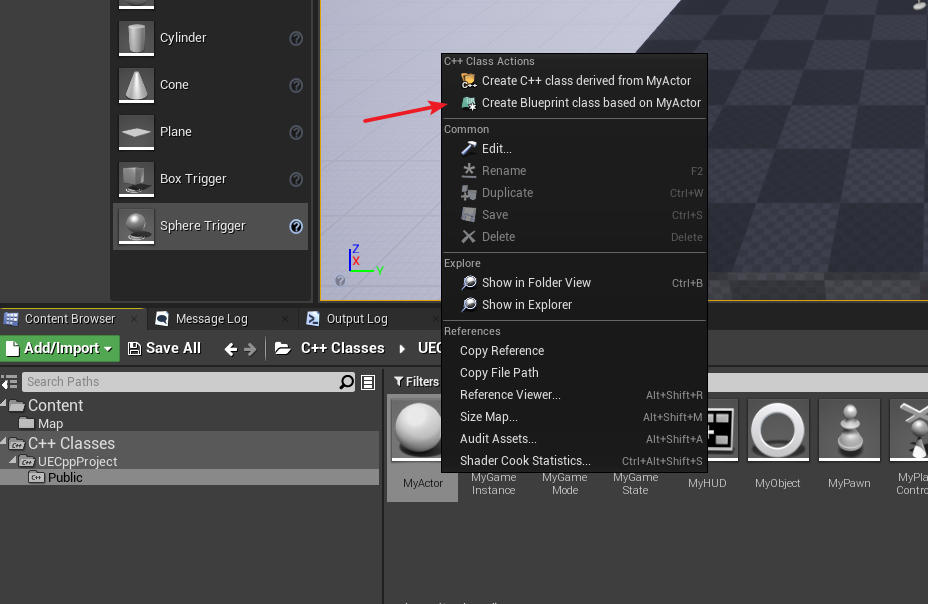

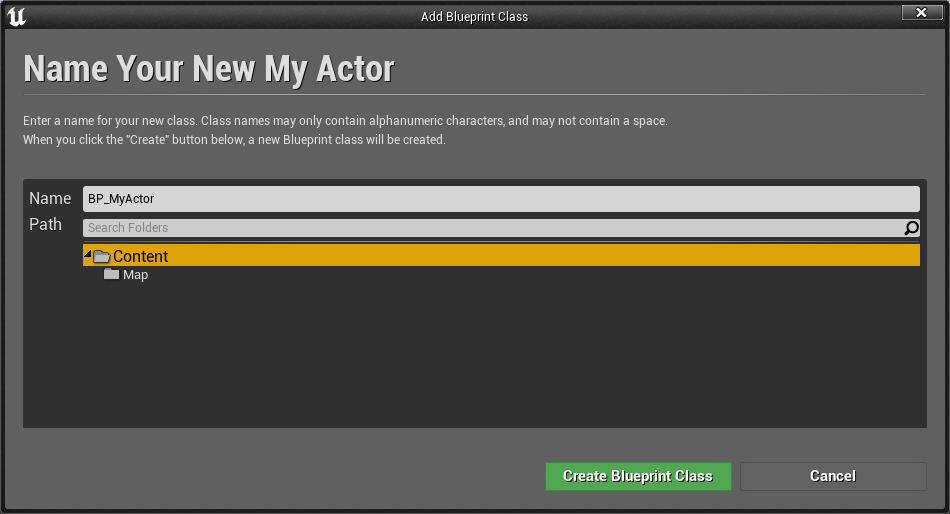


双击打开新创建的BP_MyActor蓝图

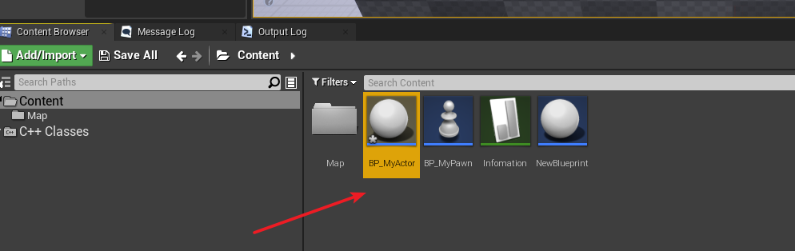


可以看到使用代码创建的Component和父子级关系

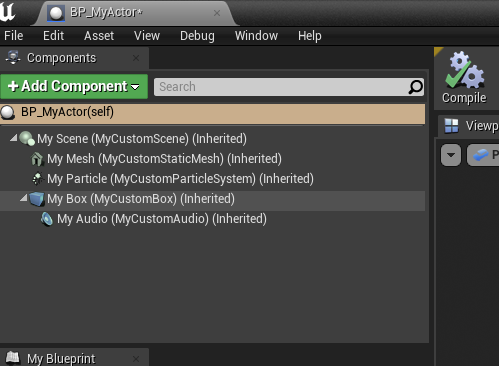


# 静态加载类和资源

## 静态加载资源

### 添加初学者包


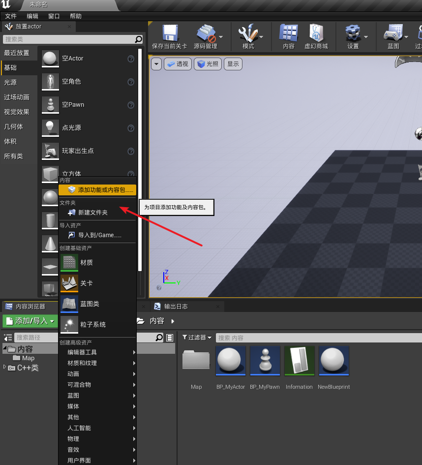


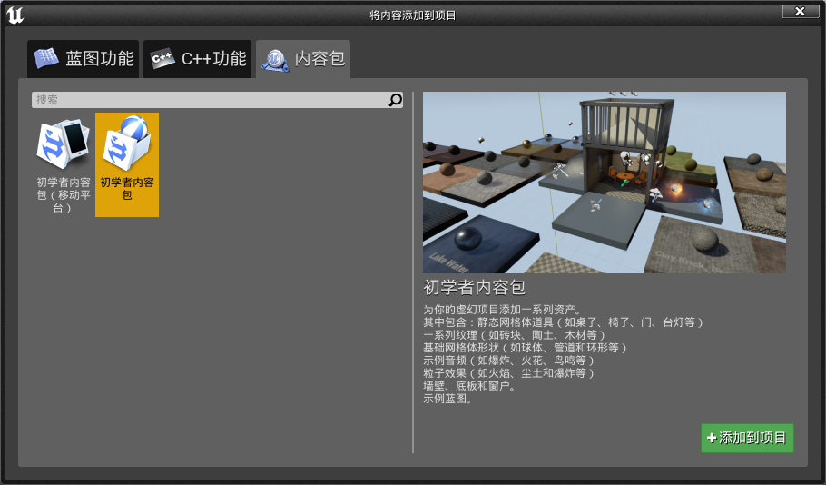


### 代码添加静态资源

```cpp
AMyActor::AMyActor()
{
 	// Set this actor to call Tick() every frame.  You can turn this off to improve performance if you don't need it.
	PrimaryActorTick.bCanEverTick = true;

	MyScene = CreateDefaultSubobject<USceneComponent>(TEXT("MyCustomScene"));
	MyMesh = CreateDefaultSubobject<UStaticMeshComponent>(TEXT("MyCustomStaticMesh"));
	MyParticle = CreateDefaultSubobject<UParticleSystemComponent>(TEXT("MyCustomParticleSystem"));
	MyBox = CreateDefaultSubobject<UBoxComponent>(TEXT("MyCustomBox"));
	MyAudio = CreateDefaultSubobject<UAudioComponent>(TEXT("MyCustomAudio"));

	RootComponent = MyScene;
	MyMesh->SetupAttachment(MyScene);
	MyParticle->SetupAttachment(MyScene);
	MyBox->SetupAttachment(MyScene);
	MyAudio->SetupAttachment(MyBox);

	//静态加载资源
	static ConstructorHelpers::FObjectFinder<UStaticMesh> TempStaticMesh(TEXT("StaticMesh'/Game/StarterContent/Architecture/Floor_400x400.Floor_400x400'"));
	MyMesh->SetStaticMesh(TempStaticMesh.Object);
	static ConstructorHelpers::FObjectFinder<UParticleSystem> TempParticleSystem(TEXT("ParticleSystem'/Game/StarterContent/Particles/P_Explosion.P_Explosion'"));
	MyParticle->SetTemplate(TempParticleSystem.Object);
	static ConstructorHelpers::FObjectFinder<USoundWave> TempSound(TEXT("SoundWave'/Game/StarterContent/Audio/Collapse01.Collapse01'"));
	MyAudio->SetSound(TempSound.Object);

	//静态加载类

}
```

## 静态加载类

先声明一个AActor的成员变量

```cpp
	UPROPERTY(VisibleAnywhere, BlueprintReadOnly, Category = "MyClass")
		TSubclassOf<AActor> MyActor;
```


注意，这里复制的文件引用后需要增加`_C`，这是UE的格式

```cpp
AMyActor::AMyActor()
{
    ......
    //静态加载类
    static ConstructorHelpers::FClassFinder<AActor> TempMyActor(TEXT("Blueprint'/Game/StarterContent/Blueprints/Blueprint_CeilingLight.Blueprint_CeilingLight_C'"));
    MyActor = TempMyActor.Class;
}	
	

void AMyActor::BeginPlay()
{
	Super::BeginPlay();

	if (MyActor) {
		UE_LOG(LogTemp, Warning, TEXT("MyActor is %s"), *MyActor->GetName());
	}
}
```

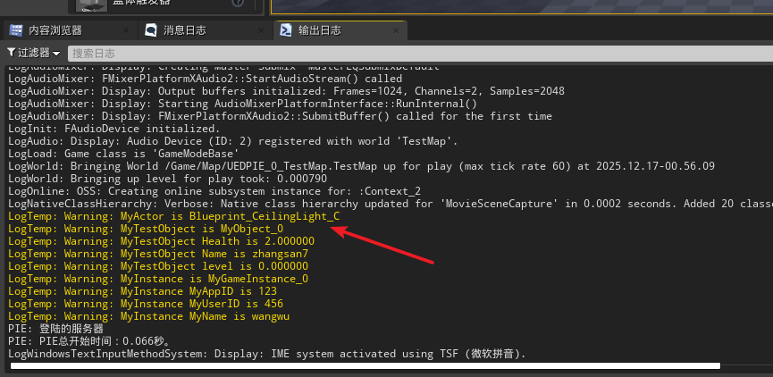


# 动态加载类和资源

动态加载就是在游戏运行的时候加载资源；静态加载资源是在代码编译的时候把资源加载进去，而且静态加载必须写在构造函数里面。


## 使用

`LoadClass`加载类资源时，注意复制的引用后需要增加`_C`，这是蓝图的规则

```cpp
void AMyActor::BeginPlay()
{
	Super::BeginPlay();

	if (MyActor) {
		UE_LOG(LogTemp, Warning, TEXT("MyActor is %s"), *MyActor->GetName());
	}
	
	//动态加载资源
	UStaticMesh* MyTempStaticMesh = LoadObject<UStaticMesh>(nullptr, TEXT("StaticMesh'/Game/StarterContent/Shapes/Shape_Cube.Shape_Cube'"));
	if (MyTempStaticMesh) {
		MyMesh->SetStaticMesh(MyTempStaticMesh);
	}

	//动态加载类资源
	UClass* MyTempClass = LoadClass<AActor>(this, TEXT("Blueprint'/Game/StarterContent/Blueprints/Blueprint_WallSconce.Blueprint_WallSconce_C'"));
	if (MyTempClass)
	{
		AActor* SpawnActor = GetWorld()->SpawnActor<AActor>(MyTempClass, FVector::ZeroVector, FRotator::ZeroRotator);

	}

}
```


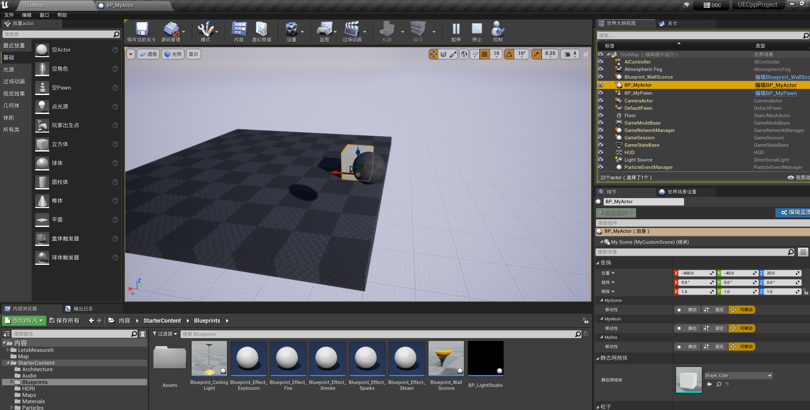


