# 创建摄像机摇臂和相机并且设置旋转位移缩放


在MyPawn.h中新增2个头文件

```cpp
#include "GameFramework/SpringArmComponent.h"
#include "Camera/CameraComponent.h"
```


在MyPawn.h中声明3个变量，分别是场景、摄像机摇臂、相机

```cpp

UCLASS()
class UECPPPROJECT_API AMyPawn : public APawn
{
	GENERATED_BODY()
......

public:
	UPROPERTY(VisibleAnywhere,BlueprintReadOnly, Category = "MySceneComponent")
	USceneComponent* MyRoot;

	UPROPERTY(VisibleAnywhere, BlueprintReadOnly, Category = "MySceneComponent")
	USpringArmComponent* MySpringArm;

	UPROPERTY(VisibleAnywhere, BlueprintReadOnly, Category = "MySceneComponent")
	UCameraComponent* MyCamera;
};

```


初始化并构建父子级关系，设置摄像机摇臂关闭碰撞测试

```cpp
AMyPawn::AMyPawn()
{
 	// Set this pawn to call Tick() every frame.  You can turn this off to improve performance if you don't need it.
	PrimaryActorTick.bCanEverTick = true;

	//创建3个组件，分别是场景、摄像机摇臂、相机
	MyRoot = CreateDefaultSubobject<USceneComponent>(TEXT("MyRootComponent"));
	MySpringArm = CreateDefaultSubobject<USpringArmComponent>(TEXT("MySpringArmComponent"));
	MyCamera = CreateDefaultSubobject<UCameraComponent>(TEXT("MyCameraComponent"));
	//构建父子级关系
	RootComponent = MyRoot;
	MySpringArm->SetupAttachment(MyRoot);
	MyCamera->SetupAttachment(MySpringArm);

	MySpringArm->bDoCollisionTest = false;//关闭碰撞测试，设置没有碰撞
}
```


设置相机的位移、旋转、缩放

```cpp
// Called when the game starts or when spawned
void AMyPawn::BeginPlay()
{
	Super::BeginPlay();
	
    ......
	//设置相机的位移、旋转、缩放
	FVector MyLocation = FVector(0, 0, 0);
	FRotator MyRotation = FRotator(-50, 0, 0);
	FVector MyScale = FVector(1, 1, 1);
	SetActorLocation(MyLocation);
	SetActorRotation(MyRotation);
	SetActorScale3D(MyScale);
}
```


# 按键映射绑定并且使用鼠标滑轮控制镜头缩放远近

## 在项目设置中添加按键映射

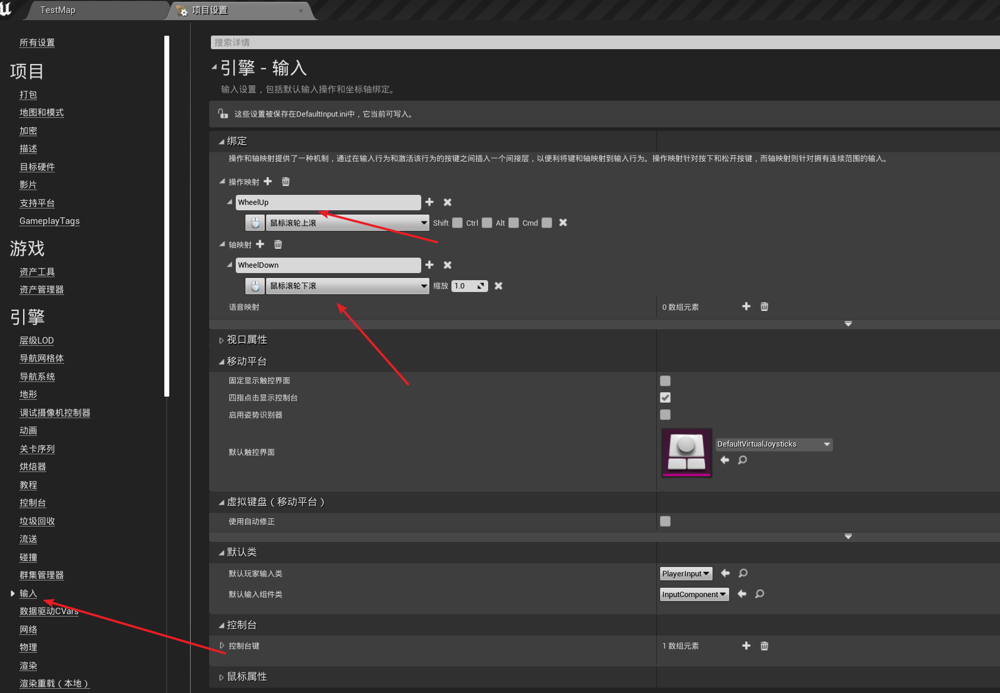


## MyPawn中添加拉近拉远的方法

注意拉近和拉远的限制值不能相等，会出现拉近拉远后不动的情况，视角就固定了

```cpp
//鼠标滑轮移动镜头缩放
void Zoom(bool Direction, float ZoomSpeed);


void AMyPawn::Zoom(bool Direction, float ZoomSpeed)
{
	if (Direction)
	{
		if (MySpringArm->TargetArmLength >= 300 && MySpringArm->TargetArmLength < 5000)
		{
			MySpringArm->TargetArmLength += (ZoomSpeed * 2);
			GEngine->AddOnScreenDebugMessage(-1, 5.0f, FColor::Red,FString::Printf(TEXT("SpringArmLength is %f"), MySpringArm->TargetArmLength));
		}
	}
	else
	{
		if (MySpringArm->TargetArmLength > 300 && MySpringArm->TargetArmLength <= 5000)
		{
			MySpringArm->TargetArmLength -= (ZoomSpeed * 2);
			GEngine->AddOnScreenDebugMessage(-1, 5.0f, FColor::Red, FString::Printf(TEXT("SpringArmLength is %f"), MySpringArm->TargetArmLength));
		}
	}
}
```


## PlayerController中绑定鼠标事件

```cpp

UCLASS()
class UECPPPROJECT_API AMyPlayerController : public APlayerController
{
	GENERATED_BODY()
	
public:
	virtual void SetupInputComponent() override;

	void WheelUpFunction();
	void WheelDownFunction();
};
```


```cpp
#include "MyPawn.h"
#include "MyPlayerController.h"

void AMyPlayerController::SetupInputComponent()
{
	Super::SetupInputComponent();

	InputComponent->BindAction("WheelUp", IE_Pressed, this, &AMyPlayerController::WheelUpFunction);
	InputComponent->BindAction("WheelDown", IE_Pressed, this, &AMyPlayerController::WheelDownFunction);
}

void AMyPlayerController::WheelUpFunction()
{
	if (GetPawn())
	{
		AMyPawn* MyCameraPawn = Cast<AMyPawn>(GetPawn());
		if (MyCameraPawn)
		{
			MyCameraPawn->Zoom(1, 10);
		}
	}
}

void AMyPlayerController::WheelDownFunction()
{
	if (GetPawn())
	{
		AMyPawn* MyCameraPawn = Cast<AMyPawn>(GetPawn());
		if (MyCameraPawn)
		{
			MyCameraPawn->Zoom(0, 10);
		}
	}
}
```

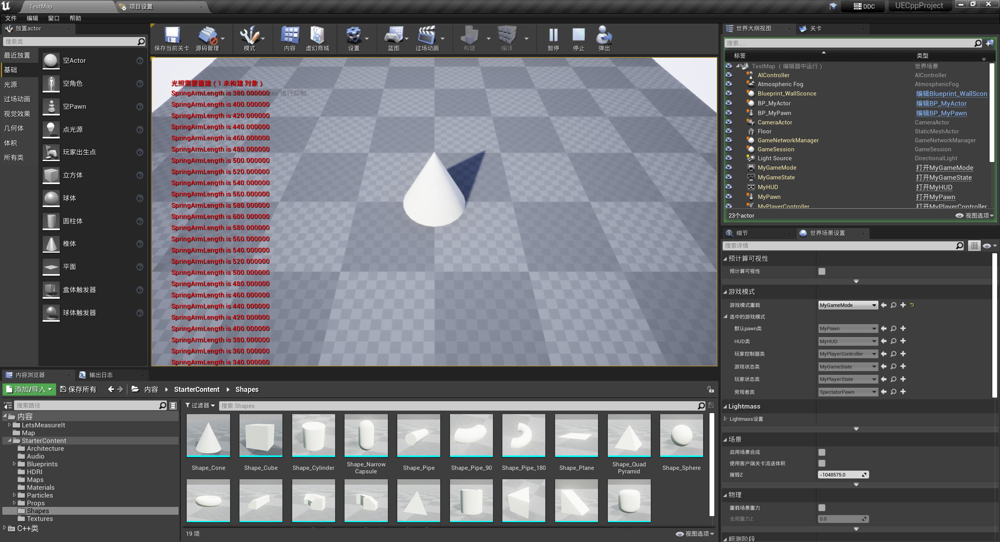


# AddActorLocalOffset和AddActorWorldOffset


本地坐标偏移、世界坐标偏移

```cpp
// Called every frame
void AMyActor::Tick(float DeltaTime)
{
	Super::Tick(DeltaTime);

	FVector MyOffset = FVector(1, 0, 0);
	FHitResult HitResult; //碰撞信息
	//添加Actor的本地坐标偏移
	AddActorLocalOffset(MyOffset, false, &HitResult);

	//添加Actor的世界坐标偏移
	//AddActorWorldOffset(MyOffset, false, &HitResult);
}
```


# BeginOverlap和EndOverlap代理绑定

一个物体和另一个物体产生重叠后就会触发这个

## 绑定

```cpp

UCLASS()
class UECPPPROJECT_API AMyActor : public AActor
{
	GENERATED_BODY()
	......


	UFUNCTION()
	void BeginOverlapFunction(UPrimitiveComponent* OverlappedComponent, AActor* OtherActor, UPrimitiveComponent* OtherComp, int32 OtherBodyIndex, bool bFromSweep, const FHitResult& SweepResult);

	UFUNCTION()
	void EndOverlapFunction(UPrimitiveComponent* OverlappedComponent, AActor* OtherActor, UPrimitiveComponent* OtherComp, int32 OtherBodyIndex);
};

```


```cpp
// Called when the game starts or when spawned
void AMyActor::BeginPlay()
{
	......

	//动态绑定BeginOverlap和EndOverlap
	MyBox->OnComponentBeginOverlap.AddDynamic(this,&AMyActor::BeginOverlapFunction);
	MyBox->OnComponentEndOverlap.AddDynamic(this, &AMyActor::EndOverlapFunction);
}
```


```cpp

void AMyActor::BeginOverlapFunction(UPrimitiveComponent* OverlappedComponent, AActor* OtherActor, UPrimitiveComponent* OtherComp, int32 OtherBodyIndex, bool bFromSweep, const FHitResult& SweepResult)
{
	GEngine->AddOnScreenDebugMessage(-1, 5.0f, FColor::Red, TEXT("BeginOverlapEvent is success!"));
}

void AMyActor::EndOverlapFunction(UPrimitiveComponent* OverlappedComponent, AActor* OtherActor, UPrimitiveComponent* OtherComp, int32 OtherBodyIndex)
{
	GEngine->AddOnScreenDebugMessage(-1, 5.0f, FColor::Red, TEXT("EndOverlapEvent is success!"));
}
```


## 添加第三人称蓝图

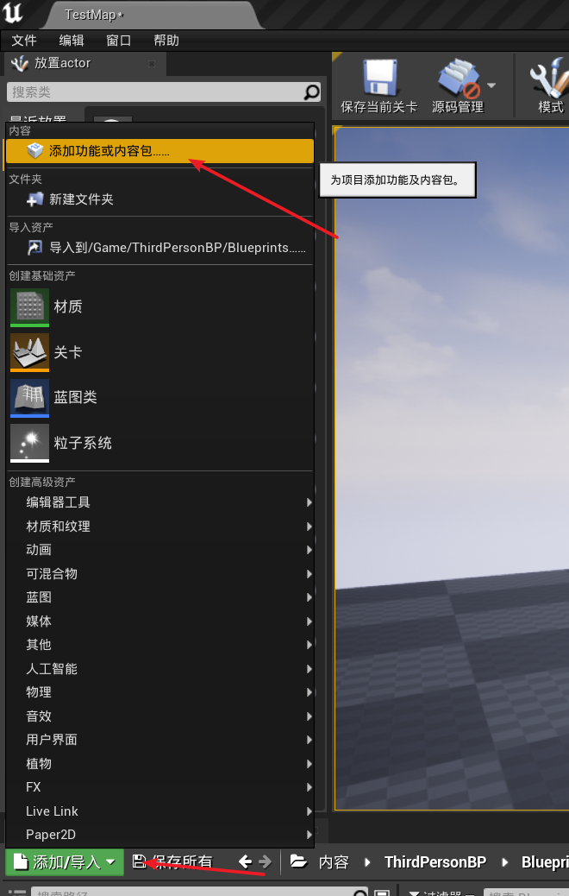

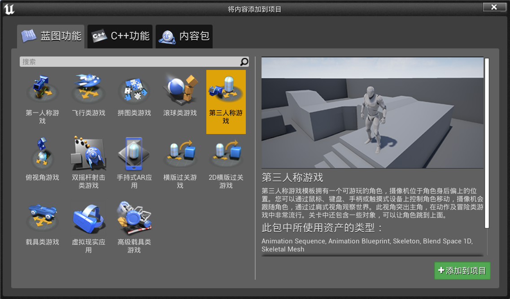


将 ThirdPersonCharacter 拖入到场景中，

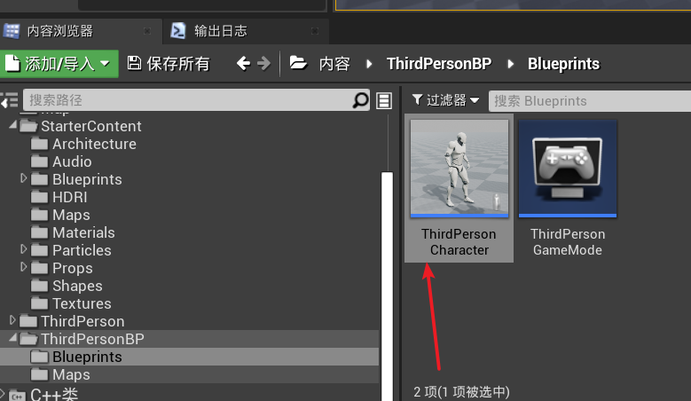


设置玩家0控制

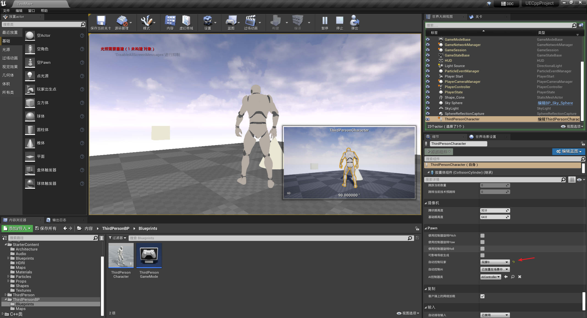


给MyBox的缩放都设置为5

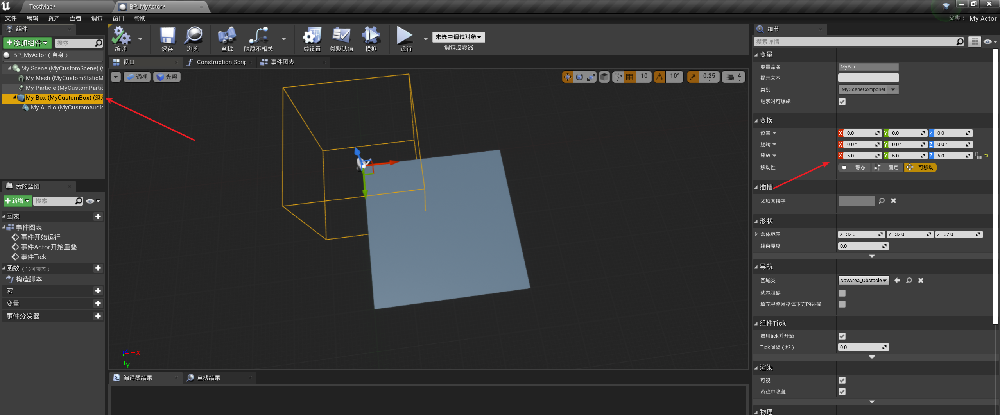


使用键盘的上下左右键控制人来触发

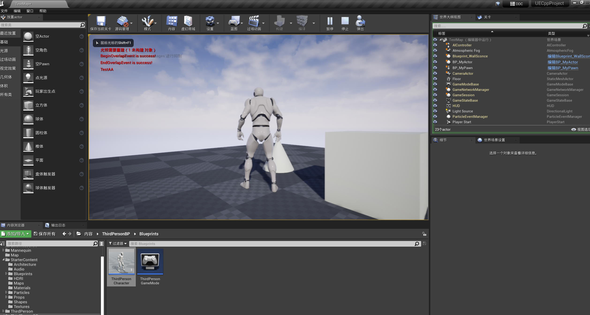


# Hit事件的代理绑定

```h
UFUNCTION()
void HitFunction(UPrimitiveComponent* HitComponent, AActor* OtherActor, UPrimitiveComponent* OtherComp, FVector NormalImpulse, const FHitResult& Hit);
```


```cpp
// Called when the game starts or when spawned
void AMyActor::BeginPlay()
{
	Super::BeginPlay();
    ......
	MyBox->OnComponentHit.AddDynamic(this, &AMyActor::HitFunction);
}
```


```cpp
void AMyActor::HitFunction(UPrimitiveComponent* HitComponent, AActor* OtherActor, UPrimitiveComponent* OtherComp, FVector NormalImpulse, const FHitResult& Hit)
{
	GEngine->AddOnScreenDebugMessage(-1, 5.0f, FColor::Red, TEXT("HitFunction is success!"));
}
```


打开BP_MyActor，选中MyBox，设置模拟生成命中事件（生成hit事件），碰撞预设选择Custom，勾选Pawn的阻挡

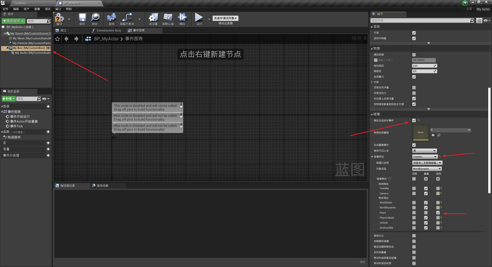


# 碰撞设置

```cpp

// Sets default values
AMyActor::AMyActor()
{
    ......
	//碰撞设置
	MyBox->SetCollisionEnabled(ECollisionEnabled::NoCollision);
	MyBox->SetCollisionEnabled(ECollisionEnabled::QueryOnly);
	MyBox->SetCollisionEnabled(ECollisionEnabled::PhysicsOnly);
	MyBox->SetCollisionEnabled(ECollisionEnabled::QueryAndPhysics);

	//碰撞对象类型
	MyBox->SetCollisionObjectType(ECC_WorldStatic);
	MyBox->SetCollisionObjectType(ECC_WorldDynamic);
	MyBox->SetCollisionObjectType(ECC_Pawn);
	MyBox->SetCollisionObjectType(ECC_PhysicsBody);
	MyBox->SetCollisionObjectType(ECC_Vehicle);
	MyBox->SetCollisionObjectType(ECC_Destructible);

	//碰撞响应
	MyBox->SetCollisionResponseToAllChannels(ECR_Block); //对所有的通道进行设置响应为Block，阻挡
	MyBox->SetCollisionResponseToAllChannels(ECR_Overlap); //对所有的通道进行设置响应为Overlap，重叠
	MyBox->SetCollisionResponseToAllChannels(ECR_Ignore); //忽略
	MyBox->SetCollisionResponseToChannel(ECC_Pawn, ECR_Overlap);//对单个通道设置响应
	MyBox->SetCollisionResponseToChannel(ECC_WorldStatic, ECR_Block);//
	MyBox->SetCollisionResponseToChannel(ECC_WorldDynamic, ECR_Ignore);
}
```


# 粒子特效的激活和失效

## 设置碰撞

```cpp
// Sets default values
AMyActor::AMyActor()
{
 	......

	//碰撞设置
	//MyBox->SetCollisionEnabled(ECollisionEnabled::NoCollision);
	MyBox->SetCollisionEnabled(ECollisionEnabled::QueryOnly);
	//MyBox->SetCollisionEnabled(ECollisionEnabled::PhysicsOnly);
	//MyBox->SetCollisionEnabled(ECollisionEnabled::QueryAndPhysics);

	//碰撞对象类型
	//MyBox->SetCollisionObjectType(ECC_WorldStatic);
	MyBox->SetCollisionObjectType(ECC_WorldDynamic);
	//MyBox->SetCollisionObjectType(ECC_Pawn);
	//MyBox->SetCollisionObjectType(ECC_PhysicsBody);
	//MyBox->SetCollisionObjectType(ECC_Vehicle);
	//MyBox->SetCollisionObjectType(ECC_Destructible);

	//碰撞响应
	//MyBox->SetCollisionResponseToAllChannels(ECR_Block); //对所有的通道进行设置响应为Block，阻挡
	MyBox->SetCollisionResponseToAllChannels(ECR_Overlap); //对所有的通道进行设置响应为Overlap，重叠
	//MyBox->SetCollisionResponseToAllChannels(ECR_Ignore); //忽略
	//MyBox->SetCollisionResponseToChannel(ECC_Pawn, ECR_Overlap);//对单个通道设置响应
	//MyBox->SetCollisionResponseToChannel(ECC_WorldStatic, ECR_Block);//
	//MyBox->SetCollisionResponseToChannel(ECC_WorldDynamic, ECR_Ignore);

	//设置Box大小
	MyBox->SetBoxExtent(FVector(64, 64, 64));
}

// Called when the game starts or when spawned
void AMyActor::BeginPlay()
{
	Super::BeginPlay();

	//默认粒子不激活
	if (MyParticle) {
		MyParticle->Deactivate();
	}

    ......
}
```

## 设置碰撞时触发

```cpp
void AMyActor::BeginOverlapFunction(UPrimitiveComponent* OverlappedComponent, AActor* OtherActor, UPrimitiveComponent* OtherComp, int32 OtherBodyIndex, bool bFromSweep, const FHitResult& SweepResult)
{
	if (MyParticle) {
		MyParticle->Activate();
	}
	GEngine->AddOnScreenDebugMessage(-1, 5.0f, FColor::Red, TEXT("BeginOverlapEvent is success!"));
}

void AMyActor::EndOverlapFunction(UPrimitiveComponent* OverlappedComponent, AActor* OtherActor, UPrimitiveComponent* OtherComp, int32 OtherBodyIndex)
{
	if (MyParticle) {
		MyParticle->Deactivate();
	}
	GEngine->AddOnScreenDebugMessage(-1, 5.0f, FColor::Red, TEXT("EndOverlapEvent is success!"));
}
```


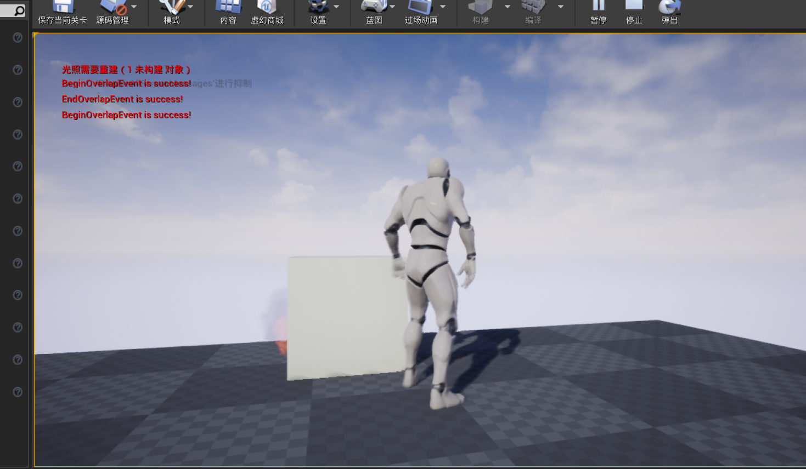

# 创建UserWidget并且绑定Button点击事件

## 创建UserWidget

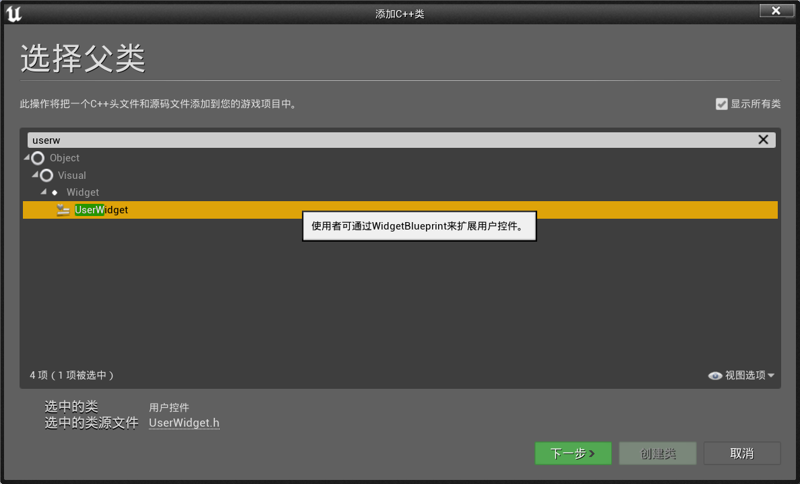


引入Button头文件

```h
#include "Components/Button.h"
```


创建2个Button按钮和对应的OnClick触发后的方法

> 注意这里的Button的命名，蓝图中需要一致

```cpp
UCLASS()
class UECPPPROJECT_API UMyUserWidget : public UUserWidget
{
	GENERATED_BODY()

public:
	UPROPERTY(meta = (BindWidget))
		UButton* ButtonStart;
	UPROPERTY(meta = (BindWidget))
		UButton* ButtonQuit;

	virtual bool Initialize() override;

	UFUNCTION()
		void Start();
	UFUNCTION()
		void Quit();
};
```


```cpp

#include "MyUserWidget.h"

bool UMyUserWidget::Initialize()
{
    if (!Super::Initialize()) {
        return false;
    }
    ButtonStart->OnClicked.AddDynamic(this, &UMyUserWidget::Start);
    ButtonQuit->OnClicked.AddDynamic(this, &UMyUserWidget::Quit);
    return true;
}

void UMyUserWidget::Start()
{
    GEngine->AddOnScreenDebugMessage(-1, 5.0f, FColor::Red, TEXT("Start"));
}

void UMyUserWidget::Quit()
{
    GEngine->AddOnScreenDebugMessage(-1, 5.0f, FColor::Red, TEXT("Quit"));
}
```


## 创建控件蓝图

创建控件蓝图，命名为`UMG_Widget`

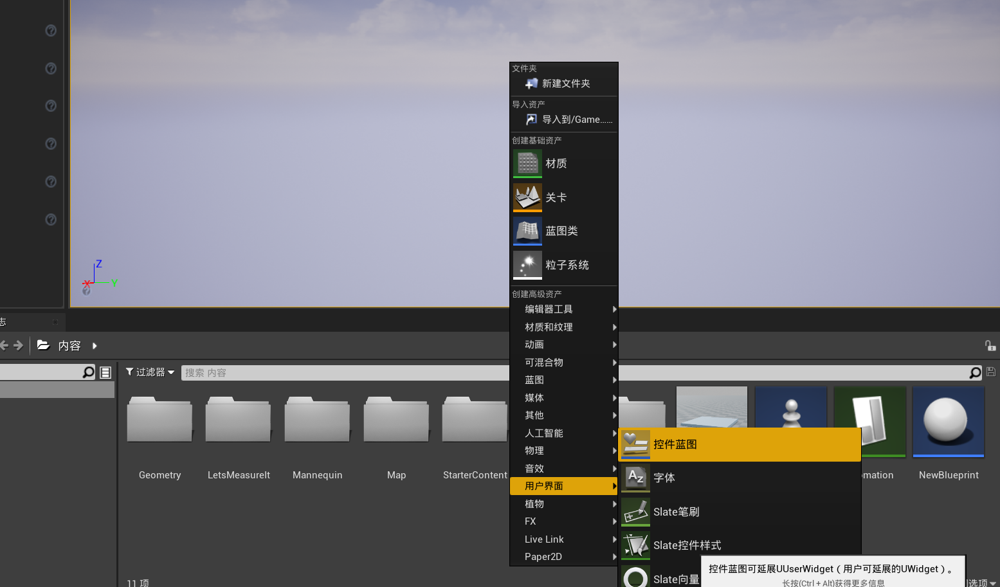


双击打开控件蓝图，拖入2个按钮，命名需要和代码中一致

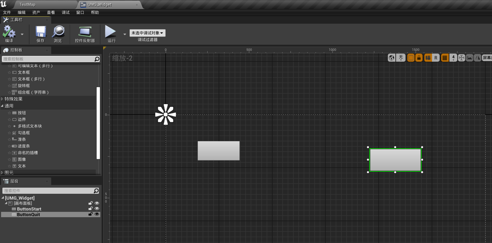


点击类设置，选择MyUserWidget作为父类

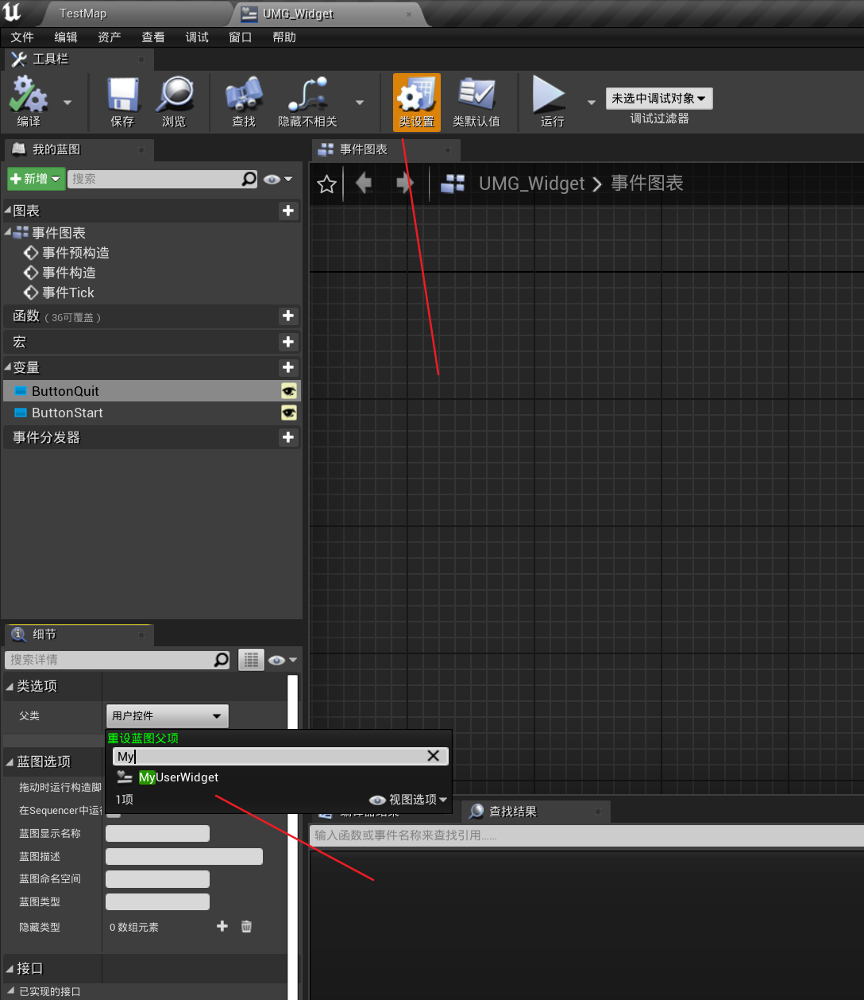


## PlayerController中创建界面并显示

```cpp
UCLASS()
class UECPPPROJECT_API AMyPlayerController : public APlayerController
{
	GENERATED_BODY()
	
public:
	virtual void SetupInputComponent() override;

	//鼠标滚轮向上滚  绑定的事件
	void WheelUpFunction();
	//鼠标滚轮向下滚  绑定的事件
	void WheelDownFunction();

	virtual void BeginPlay() override;	+++
};
```


引入UserWidget头文件

```h
#include "Blueprint/UserWidget.h"
```


创建用户控件蓝图，并显示在界面中

```cpp
void AMyPlayerController::BeginPlay()
{
	Super::BeginPlay();

	UClass* widgetClass = LoadClass<UUserWidget>(NULL, TEXT("WidgetBlueprint'/Game/UMG_Widget.UMG_Widget_C'"));
	UUserWidget* MyWidgetClass = nullptr;
	MyWidgetClass = CreateWidget<UUserWidget>(GetWorld(), widgetClass);
	MyWidgetClass->AddToViewport();
}
```


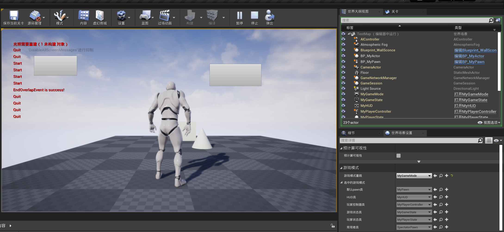

# 进度条Progress的实现


# 单播代理


# 多播代理


# 动态多播代理


# 子弹类型设置


# 创建Character添加增强输入


# 创建Interface接口


# 创建TimeHandle定时器


# 创建3DWidget并渲染到屏幕

# 创建ApplyDamage并且接受伤害TakeDamage

